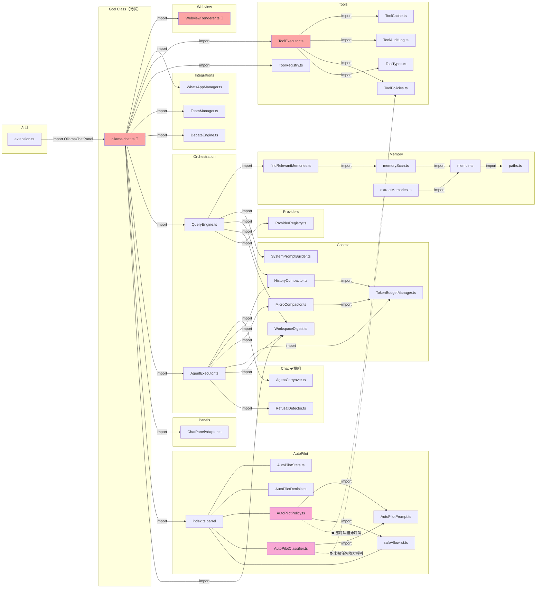
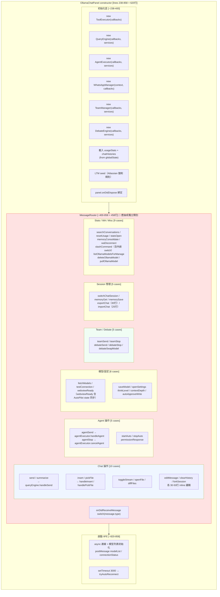
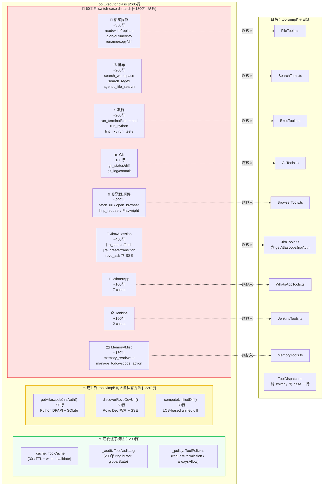
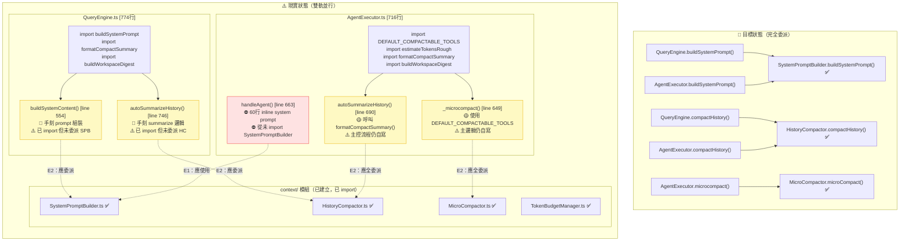
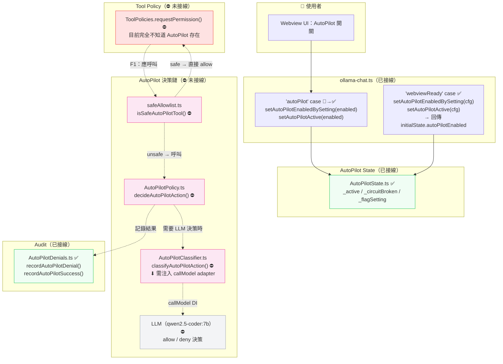
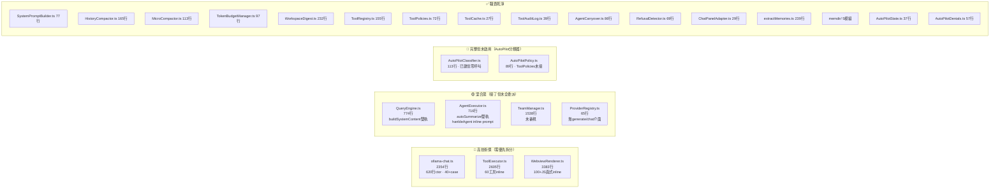
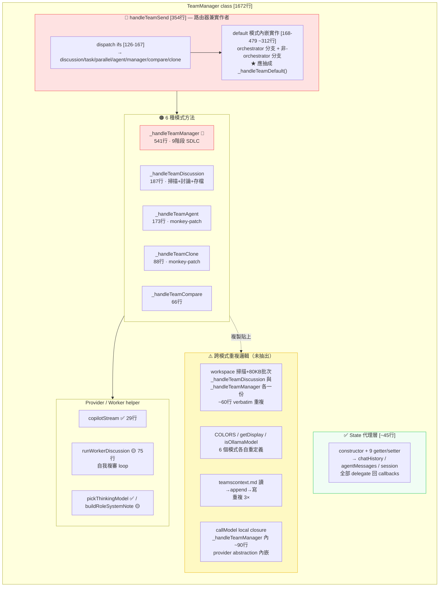

# ClaudeDoTo.md

> 目的：提供給 LLM / Agent 閱讀的移植分析文件。  
> 範圍：比較 `d:\Tools\claude-code` 與 `D:\Tools\AmiClaw`，整理 Claude Code 的功能方塊圖、與 AmiClaw 現況落差、以及適合移植的功能清單。  
> 注意：本文件以**架構參考、模組職責、功能設計**為主，不建議逐字搬運來源程式碼。  
> 命名說明：本文件中「AmiClaw」指本專案（舊名 Ollama / Ollama Chat）；「Ollama」單指本機 LLM runtime（`/api/chat`、`OllamaProvider` 等）。

---

## 1. 專案定位摘要

### 1.1 claude-code

來源觀察：
- `package.json`
- `src/entrypoints/cli.tsx`
- `src/main.tsx`
- `src/tools.ts`
- `docs/introduction/architecture-overview.mdx`
- `README.md`
- `TODO.md`
- `build.ts`
- `packages/*`

定位：
- 一個 **Bun workspaces monorepo**。
- 主要產品是 **終端型 AI coding assistant CLI**。
- 核心強項不是單一 UI，而是完整的：
  - CLI 入口與模式切換
  - 對話編排 / Agent loop
  - 多 provider API 通訊
  - 大量工具系統
  - 權限與政策控制
  - MCP 生態整合
  - session / transcript / memory / compact / hooks / plugins
- 設計重點是：**可長時間運作的工程化 AI runtime**。

### 1.2 AmiClaw

來源觀察：
- `package.json`
- `Context.md`
- `src/extension.ts`
- `src/ollama-chat.ts`
- `src/webview/WebviewRenderer.ts`
- `scripts/health-check.js`
- `docker-compose.yml`
- `knip.json`

定位：
- 一個 **VS Code Extension**（`publisher.name = ami-ai-claw`，舊名 Ollama / Ollama Chat）。
- 主要產品是 **本機 Ollama 聊天側邊欄 + Agent 工具呼叫 + 多角色協作**。
- 已有不少實用整合：
  - Webview chat UI
  - Agent tool calling（Ollama 原生 function call + Copilot fallback）
  - Team / debate / manager 模式
  - WhatsApp / Jira / Jenkins / browser / file / git / tests 等工具
- 目前最大問題不是功能太少，而是：
  - `src/ollama-chat.ts` 仍偏大（2509 行）
  - `src/tools/ToolExecutor.ts` 過肥（2714 行）
  - `src/webview/WebviewRenderer.ts` 也偏大（3327 行）
  - UI / orchestration / tool executor / integrations / session state 高度耦合
  - 缺乏像 Claude Code 那樣清楚的層次化 runtime 邊界

---

## 2. claude-code 功能方塊圖

以下方塊圖是依據已閱讀檔案與文件整理出的**高層架構**。

## 2.1 五層核心架構

```text
[ User / Terminal ]
        |
        v
+-------------------------+
|  Interaction Layer      |
|  REPL / screens / Ink   |
|  slash commands         |
+-------------------------+
        |
        v
+-------------------------+
|  Orchestration Layer    |
|  QueryEngine            |
|  session / transcript   |
|  cost tracking          |
|  resume / file history  |
+-------------------------+
        |
        v
+-------------------------+
|  Agentic Loop Layer     |
|  query.ts               |
|  model call loop        |
|  tool-use loop          |
|  compaction / retry     |
+-------------------------+
        |
        v
+-------------------------+
|  Tool Capability Layer  |
|  tools.ts / Tool.ts     |
|  file/bash/web/search   |
|  agent/task/mcp/etc     |
+-------------------------+
        |
        v
+-------------------------+
|  Provider / Infra Layer |
|  services/api/*         |
|  Anthropic/Bedrock      |
|  Vertex/Azure/OAuth     |
|  MCP / plugins / policy |
+-------------------------+
```

## 2.2 claude-code 模組責任圖（2026-06-30 重查）

> 本節在 2026-06-30 依實機 `d:\Tools\claude-code` 重查；行數為當下實際值，與 §15.1 AmiClaw 模組責任圖採同格式對照。

```text
src/entrypoints/cli.tsx                  [297 行]
  -> 啟動入口
  -> feature/MACRO polyfill
  -> fast-path dispatch（--version / --dump-system-prompt / daemon / bridge / bg / chrome / tmux）
  -> 動態載入 main.tsx

src/main.tsx                             [6561 行] ← 巨型 CLI 定義
  -> Commander.js 命令樹（mcp / server / ssh / open / auth / plugin / agents / auto-mode / doctor / update ...）
  -> 啟動初始化（auth / config / migrations / policy / telemetry）
  -> 權限模式 / MCP / 會話恢復
  -> REPL / Headless 分發

src/QueryEngine.ts                       [1258 行]
  -> 會話狀態編排
  -> transcript / usage / file history snapshots
  -> compaction trigger
  -> query() 呼叫封裝 + 屬性歸因
  ★ 對應 AmiClaw: src/chat/QueryEngine.ts（828 行，無 transcript/file history）

src/query.ts                             [1615 行]
  -> 單回合 agentic loop
  -> 上下文預處理（含 microCompact）
  -> 呼叫模型（透過 services/api）
  -> 收集 tool use + 執行工具
  -> 判斷是否續輪
  ★ 對應 AmiClaw: src/chat/AgentExecutor.ts（914 行）

src/tools.ts                             [371 行]
  -> 工具註冊中心
  -> assembleToolPool(): built-in + MCP 合併
  -> filterToolsByDenyRules(): 權限過濾
  -> feature flag / USER_TYPE 條件啟用

src/Tool.ts                              [754 行]
  -> Tool 介面定義
  -> findToolByName / toolMatchesName 工具函式
  ★ 對應 AmiClaw: 全部塞在 src/tools/ToolExecutor.ts（2714 行）

src/tools/<ToolName>/*                   [55 個 tool 目錄]
  -> 每個 tool 一個目錄（name / description / inputSchema / call() + 可選 React 渲染元件）
  -> 例：AgentTool, BashTool, FileEditTool, GrepTool, LSPTool, MCPTool,
        PowerShellTool, WebBrowserTool, WorkflowTool, TaskCreateTool, SkillTool,
        VerifyPlanExecutionTool, ScheduleCronTool, MonitorTool ...

src/context.ts                           [167 行]
  -> system / user context 組裝（git status / 日期 / CLAUDE.md / memory files）
  ★ 對應 AmiClaw: src/context/SystemPromptBuilder.ts（90 行，孤兒）+ 散落於 QueryEngine.buildSystemContent

src/services/api/*
  -> 多 provider 通訊層
  -> Anthropic / Bedrock / Vertex / Azure
  -> openai/ → OpenAI 相容層（Ollama / DeepSeek / vLLM）
  -> gemini/ → Google Gemini API
  -> stream / request assembly / model mapping
  ★ 對應 AmiClaw: ⛔ 不存在，Ollama/Copilot 呼叫直接寫在 ollama-chat.ts

src/services/mcp/*
  -> MCP server/client/config/resource/tool 整合
  ★ 對應 AmiClaw: ⛔ P1-2 尚未開始

src/services/compact/*
  -> autoCompact / compact / microCompact / contextCollapse
  ★ 對應 AmiClaw: src/context/{HistoryCompactor, MicroCompactor, TokenBudgetManager}.ts（已建立但孤兒）

src/services/SessionMemory/*
src/services/extractMemories/*
src/services/sessionTranscript/*
src/services/teamMemorySync/*
src/services/AgentSummary/*
src/services/toolUseSummary/*
  -> 記憶 / transcript / 摘要等多條獨立 pipeline
  ★ 對應 AmiClaw: 只有 src/services/extractMemories（已落地）+ src/memdir（已落地）

src/services/lsp/*
src/services/MagicDocs/*
src/services/plugins/*
src/services/skillSearch/*
src/services/policyLimits/*
src/services/oauth/*
src/services/settingsSync/*
src/services/remoteManagedSettings/*
src/services/tips/*
src/services/PromptSuggestion/*
src/services/analytics/*
src/services/autoDream/*
  -> 各式 service-as-feature；多數受 feature flag 控制
  ★ 對應 AmiClaw: 全部 ⛔ 不存在（P2 範疇）

src/bridge/                              [feature: BRIDGE_MODE]
  -> 遠端遙控 / bridge API / JWT auth / 權限回調
src/daemon/                              [feature: DAEMON]
  -> 長駐 supervisor + workerRegistry
src/buddy/, src/proactive/, src/coordinator/, src/voice/
  -> 各 feature-gated 子系統
  ★ 對應 AmiClaw: 全部 ⛔ 不適用（VS Code extension 不需要 daemon/bridge/voice）

src/screens/REPL.tsx + src/components/ + src/ink/
  -> React/Ink 終端 UI（170+ 元件）
  ★ 對應 AmiClaw: src/webview/WebviewRenderer.ts（3327 行單檔 HTML 生成，形態完全不同）

src/state/AppState.tsx + src/state/store.ts + src/bootstrap/state.ts
  -> 集中式 state + Zustand-style store + module-level singletons
  ★ 對應 AmiClaw: ⛔ 散落於 ollama-chat.ts，未建 state/PanelState.ts

packages/*
  -> @ant/computer-use-{mcp,input,swift} → 跨平台桌面操控（feature: CHICAGO_MCP）
  -> @ant/claude-for-chrome-mcp → 瀏覽器控制
  -> audio-capture-napi / image-processor-napi / color-diff-napi → 原生能力
  ★ 對應 AmiClaw: ⛔ 未開 monorepo，不必移植
```

**模組組成統計（2026-06-30）：**

| 維度 | claude-code | AmiClaw | 倍數 |
|---|---|---|---|
| 頂層 src/ 子目錄數 | 41 | 9 | 4.6× |
| tools/<Name>/ 目錄數 | 55 | 0（清單寫死於 ToolExecutor.ts） | — |
| services/ 子模組數 | 24 | 1（extractMemories） | 24× |
| `main.tsx` / 入口大小 | 6561 行 | extension.ts 374 + ollama-chat.ts 2509 | — |
| QueryEngine 大小 | 1258 行 | 828 行 | 0.66× |
| Agentic loop 大小 | query.ts 1615 行 | AgentExecutor.ts 914 行 | 0.57× |
| 工具總實作大小 | tools.ts 371 + Tool.ts 754 + 55 個 tool 目錄 | ToolExecutor.ts 2714（含全部工具） | — |

## 2.3 claude-code 擅長的核心能力

### A. Runtime orchestration 能力
- 清楚分成入口、編排、迴圈、工具、通訊層。
- 適合長回合 Agent 任務。
- 能在大上下文與多工具間維持狀態一致性。

### B. Tool platform 能力
- `src/tools.ts` 是清楚的工具總表。
- 工具啟用條件、deny rules、環境開關、MCP 合併都有明確機制。
- 工具不是零散功能，而是被當成**平台能力**管理。

### C. Context / memory / compact 能力
- 有完整 system prompt 建構、上下文組裝、壓縮、session memory、extract memories。
- 這是 Claude Code 能處理長對話與大型任務的重要原因。

### D. Provider abstraction 能力
- 通訊層可支援多家 provider。
- API 差異被收斂到 `services/api/*`。

### E. MCP / plugin / slash command 生態
- 支援 MCP、plugin、skills、commands。
- 代表它比較像 AI 開發 runtime，而非單一聊天 UI。

---

## 3. AmiClaw 現況功能方塊圖

## 3.1 目前高層結構

```text
[ VS Code Extension Host ]
        |
        v
+-----------------------------+
| extension.ts                |
| - activate                  |
| - commands                  |
| - sessions tree view        |
+-----------------------------+
        |
        v
+-----------------------------+
| OllamaChatPanel             |
| src/ollama-chat.ts          |
| - panel lifecycle           |
| - message router            |
| - chat/agent/team/debate    |
| - tool execution            |
| - session/history/state     |
| - integrations              |
+-----------------------------+
        |
        +--------------------+--------------------+-------------------+
        |                    |                    |                   |
        v                    v                    v                   v
+---------------+   +----------------+   +----------------+  +----------------+
| Webview UI    |   | Ollama/Copilot |   | VS Code tools  |  | External integ |
| Renderer      |   | model calls    |   | files/git/test |  | Jira/WA/Jenkins|
+---------------+   +----------------+   +----------------+  +----------------+
```

## 3.2 實際狀況

`Context.md` 已明確指出：
- `src/ollama-chat.ts` 約 9740 行，原本是 God class。
- 已開始拆分，但目前核心仍偏集中。
- 已規劃拆成：
  - `panels/OllamaChatPanel.ts`
  - `chat/QueryEngine.ts`
  - `chat/AgentExecutor.ts`
  - `team/TeamManager.ts`
  - `debate/DebateEngine.ts`
  - `integrations/JiraManager.ts`
  - `integrations/WhatsAppManager.ts`
  - `tools/ToolExecutor.ts`
  - `webview/WebviewRenderer.ts`
  - `session/SessionManager.ts`
  - `models/ModelFetcher.ts`
  - `state/PanelState.ts`

這個拆分方向，**本質上已經很接近 Claude Code 的層次化設計**。

---

## 4. claude-code vs AmiClaw 對照

## 4.1 一句話差異

- **claude-code**：成熟的 CLI 型 AI runtime / agent platform。
- **AmiClaw**：偏向 VS Code 內嵌 chat product，功能很多，但 orchestration 與 capability platform 還在整理中。

## 4.2 功能矩陣

| 面向 | claude-code | AmiClaw | 評語 |
|---|---|---|---|
| 產品形態 | CLI / terminal-first | VS Code extension / webview-first | 介面形態不同，但 backend runtime 可借鏡 |
| 架構分層 | 很清楚 | 正在拆分中 | Claude Code 明顯更成熟 |
| 會話編排 | 強 | 中到強 | AmiClaw 有 session，但抽象度較低 |
| Agent loop | 強 | 中到強 | AmiClaw 已有 agent/tool loop，但較集中在單檔 |
| 工具平台化 | 強 | 中 | AmiClaw 工具很多，但治理規則較鬆散 |
| Provider abstraction | 強 | 中 | AmiClaw 目前主軸是 Ollama + Copilot |
| MCP 整合 | 強 | 較弱 | Claude Code 明顯更完整 |
| Context 壓縮/記憶 | 強 | 中 | AmiClaw 有 auto summarize，但體系較簡化 |
| 權限模型 | 強 | 中 | Claude Code 的 permission boundary 更成熟 |
| 插件/技能系統 | 強 | 弱 | AmiClaw 目前偏內建工具集合 |
| 平台原生能力 | 有 packages | 少量 | Claude Code monorepo packages 可提供靈感 |
| VS Code 整合 | 弱 | 強 | 這是 AmiClaw 優勢 |
| 多角色/辯論 | 有 swarm 類能力 | 強 | AmiClaw 在 team/debate 很積極 |
| 外部整合 | 一般 | 強 | AmiClaw 已有 Jira/WhatsApp/Jenkins |

---

## 5. 建議移植的不是「UI」，而是「能力骨架」

對 AmiClaw 最有價值的，不是照搬 Claude Code 的 terminal UI，而是移植以下骨架：

1. **清楚的 runtime 分層**
2. **工具平台治理**
3. **context / memory / compact 管線**
4. **provider abstraction**
5. **MCP / plugin / skill 擴展點**
6. **session transcript / resume / audit / cost 統計體系**

---

## 6. 可移植功能清單（依價值排序）

以下清單是為了讓使用者從中選擇功能移植。

### P0 = 高價值、低到中風險、應優先做
### P1 = 中高價值、需要較大重構
### P2 = 高成本或平台差異大，延後

---

## 6.1 P0-1：建立 Claude-like 分層 Query Runtime

### 目標
把 AmiClaw 現有 `ollama-chat.ts` 中混合的邏輯，重構為類似 Claude Code 的：
- Entry / Panel lifecycle
- Query orchestration
- Agent loop
- Tool registry / executor
- Provider client
- Context builder
- Session state

### 參考來源
- `src/entrypoints/cli.tsx`
- `src/main.tsx`
- `src/QueryEngine.ts`
- `src/query.ts`
- `src/tools.ts`

### 對 AmiClaw 的對應拆分

```text
extension.ts
  -> 只保留 VS Code 啟動/命令/樹狀檢視

panels/OllamaChatPanel.ts
  -> webview lifecycle + host-message dispatch

chat/QueryEngine.ts
  -> build prompt / chat history / context assembly / usage

chat/AgentExecutor.ts
  -> tool loop / iteration / stop / compact trigger

tools/ToolRegistry.ts
  -> AGENT_TOOLS 宣告與啟用條件

tools/ToolExecutor.ts
  -> executeTool() + permission + cache + audit

providers/OllamaProvider.ts
providers/CopilotProvider.ts
  -> model call abstraction

context/ContextBuilder.ts
  -> active file / open files / workspace / long-term memory / prompt parts

session/SessionStore.ts
  -> sessions / import / export / fork / rename / delete
```

### 收益
- 降低 God class 複雜度。
- 讓後續功能移植成本下降。
- 讓 team / debate / agent 共用同一套核心能力。

### 風險
- 需要大規模移動現有方法與 state。
- 需要先定義跨模組 state contract。

### 建議
- **強烈建議先做**。
- 這是後面所有移植工作的基礎。

---

## 6.2 P0-2：移植 Claude Code 的 Tool Platform 思維

### 目標
把 AmiClaw 目前「很多工具 case」提升為「工具平台」。

### Claude Code 可借鏡點
- 工具集中註冊 `tools.ts`
- 權限過濾 `filterToolsByDenyRules()`
- built-in 與 MCP tools 合併 `assembleToolPool()`
- tool enable / feature gate / mode-based filtering

### AmiClaw 建議設計

```text
tools/
  ToolTypes.ts
  ToolRegistry.ts
  ToolPolicies.ts
  ToolExecutor.ts
  ToolCache.ts
  ToolAudit.ts
```

每個工具至少要有：
- `name`
- `description`
- `inputSchema`
- `category`
- `requiresConfirm`
- `isEnabled(context)`
- `execute(args, runtime)`

### 收益
- 工具新增成本下降。
- Jira / Jenkins / WhatsApp / Browser / Git / DB / Tests 都能統一治理。
- 更容易做 allow/deny、always allow、policy、審計。

### 建議功能
- 依工具類別分類：`read` `write` `run` `delete` `network` `jira` `browser`。
- 統一審批規則：
  - category policy
  - per-tool policy
  - session always allow
  - global always confirm
- 對 tool result 做快取與失效。

### 建議
- **非常值得移植**。
- 這是 Claude Code 對 AmiClaw 最有價值的骨架之一。

---

## 6.3 P0-3：移植 Context Builder + Memory Pipeline

### 目標
把 AmiClaw 現有 prompt 拼接與 history 管理，升級成固定管線。

### Claude Code 可借鏡點
- system prompt 由多段組成
- context 不是只有聊天紀錄，還包含：
  - git 狀態
  - 工作區資訊
  - memory
  - tool state
  - 其他系統提示
- 在 token 超限前，做 compact / summarize / trim

### AmiClaw 建議模組

```text
context/
  SystemPromptBuilder.ts
  WorkspaceContextBuilder.ts
  MemoryStore.ts
  HistoryCompactor.ts
  TokenBudgetManager.ts
```

### 最小可移植版本
- 統一 `buildSystemContent()` 的來源：
  - persona
  - long-term memory
  - workspace summary
  - active file summary
  - tool rules
  - Atlassian hard rules
- 增加 history budget 邏輯：
  - 超過閾值時先 summarize 舊訊息
  - summarize 後保留最近 N 輪原文
- 增加 per-session condensed memory

### 收益
- 提升長對話穩定度。
- 降低 Agent 忘記規則或上下文漂移。
- 對 team / debate / agent 都有直接收益。

### 建議
- **優先度很高**。

---

## 6.4 P0-4：移植 Session Transcript / Resume / Audit 思維

### 目標
把 AmiClaw session 提升為可追蹤、可恢復、可審計的 runtime session。

### Claude Code 可借鏡點
- transcript 持久化
- resume conversation
- usage tracking
- file history / snapshots

### AmiClaw 可直接增強的項目
- session metadata：
  - createdAt
  - lastActiveAt
  - selectedModel
  - mode(chat/agent/team/debate)
  - token estimate
  - summary
- 持久化 transcript：
  - user / assistant / tool call / tool result / approvals / errors
- restore session：
  - 開啟 VS Code 後恢復未完成 agent 狀態
- audit log 結構化：
  - tool name
  - args hash/snippet
  - result status
  - duration
  - source(UI/WA/Jira command)

### 收益
- 更適合真實開發工作流。
- 有助於除錯、回溯、合規。

### 建議
- **值得做，且與現有功能相容性高**。

---

## 6.5 P1-1：建立 Provider Abstraction Layer

### 目標
把現在 Ollama / Copilot / OpenAI-compatible 的呼叫方式抽象化。

### Claude Code 可借鏡點
- 通訊層與 orchestration 分離
- provider-specific 細節不污染上層 query flow

### 建議介面

```text
providers/
  types.ts
  OllamaProvider.ts
  CopilotProvider.ts
  OpenAICompatibleProvider.ts
  ProviderRegistry.ts
```

統一介面：
- `listModels()`
- `generate()`
- `chat()`
- `supportsTools()`
- `supportsThinking()`
- `supportsImages()`
- `normalizeToolCalls()`
- `estimateTokenUsage()`

### 收益
- 新增模型來源更容易。
- team / debate / agent 不再依賴 provider 特判。

### 建議
- 若未來 AmiClaw 要走多模型平台，這個必做。

---

## 6.6 P1-2：導入 MCP-first 擴充架構

### 目標
讓 AmiClaw 的工具不只內建，還能外接 MCP。

### Claude Code 可借鏡點
- `services/mcp/*`
- built-in 與 MCP tool pool 合併
- resource / command / server config 管理

### AmiClaw 的實際意義
目前已有很多內建工具，但如果導入 MCP：
- 可把一部分自製工具改為外部伺服器能力
- 可直接串接第三方 MCP 生態
- 可減少 extension 本體膨脹

### 最小落地方案
- 先支援 MCP server config
- 能列出 tools/resources
- 能把 MCP tools 注入 agent tool registry
- 先不做完整 plugin marketplace

### 收益
- 擴展能力大幅上升。
- 讓 AmiClaw 從單體 extension 變成 AI platform host。

### 成本
- 中高。
- 需要 tool schema / transport / error handling / approval 流程。

---

## 6.7 P1-3：移植 Slash Command / Skill 架構

### 目標
把常用高階操作收斂成指令層，而不是只靠自然語言 prompt。

### Claude Code 可借鏡點
- `/doctor`
- `/resume`
- `/memory`
- `/compact`
- `/model`
- `/permissions`
- `/review`
- `/tasks`

### AmiClaw 建議版本
在 webview 內支援命令輸入：
- `/doctor`
- `/models`
- `/memory`
- `/history`
- `/session export`
- `/tools`
- `/jira`
- `/wa`
- `/jenkins`
- `/compact`
- `/audit`

### 收益
- 操作一致性更高。
- LLM 與使用者都更容易觸發固定工作流。

### 建議
- 可在 P0 完成後加入。

---

## 6.8 P1-4：移植 Permission Boundary 設計

### 目標
讓 AmiClaw 的工具批准機制更像 Claude Code，而不是只靠 scattered confirm logic。

### Claude Code 可借鏡點
- permission mode
- deny rules
- 路徑規則
- plan mode / auto mode 差異

### AmiClaw 可實作
- session policy
- workspace policy
- tool category policy
- path scope policy
- network policy
- integration policy（Jira/WA/Jenkins/browser）

### 收益
- Agent 更安全可控。
- 可支援企業化使用情境。

### 建議
- 與 Tool Platform 一起做效果最好。

---

## 6.9 P2-1：移植 Plugin 架構

### 價值
高，但不是短期最划算。

### 原因
- Claude Code 的 plugin 基礎設施很完整，但 AmiClaw 目前更需要先穩定核心 runtime。
- 若過早做 plugin，會把不穩定的內部 API 外部化。

### 建議
- 等 P0/P1 穩定後再做。

---

## 6.10 P2-2：移植 Computer Use / Native packages

### 參考來源
- `packages/@ant/computer-use-swift`
- `packages/@ant/computer-use-input`
- `packages/audio-capture-napi`
- `packages/image-processor-napi`

### 觀察
- 有些 package 已完整，有些是 stub 或平台限定。
- 很多偏 macOS / 本機原生能力。

### 對 AmiClaw 的意義
- 若你要做桌面操作 agent，可參考設計。
- 但目前 AmiClaw 已是 VS Code extension，短期更需要的是 runtime 重構，不是桌面自動化。

### 建議
- 延後。

---

## 7. 建議移植順序

## 7.1 最推薦路線

```text
Phase 1: Runtime 骨架重構
  1. Panel / QueryEngine / AgentExecutor / ToolExecutor / SessionStore 拆出
  2. ToolRegistry + ToolPolicy + ToolAudit 統一
  3. ContextBuilder + HistoryCompactor + MemoryStore 建立

Phase 2: 能力升級
  4. Provider abstraction
  5. Transcript / Resume / richer audit / stats
  6. Slash commands

Phase 3: 生態擴展
  7. MCP integration
  8. Skill / plugin system
  9. Native/computer-use capabilities
```

## 7.2 若只能選 3 個功能移植

### 選項 A：最實用
1. Query runtime 分層
2. Tool platform + permission policy
3. Context / memory / compact pipeline

### 選項 B：想做平台化
1. Tool platform
2. Provider abstraction
3. MCP integration

### 選項 C：想提升產品可用性
1. Session transcript / resume / audit
2. Slash commands
3. Context compact / memory

---

## 8. 給 LLM 的移植決策建議

### 若目標是「先讓 AmiClaw 更穩定」
優先做：
- `P0-1 Runtime 分層`
- `P0-2 Tool Platform`
- `P0-3 Context + Memory`

### 若目標是「讓 AmiClaw 更像 Claude Code」
優先做：
- `P0-1 Runtime 分層`
- `P1-1 Provider abstraction`
- `P1-2 MCP integration`
- `P1-3 Slash command`

### 若目標是「企業內部工作流助理」
優先做：
- `P0-2 Tool Platform`
- `P1-4 Permission Boundary`
- `P0-4 Transcript / Audit / Resume`

---

## 9. 直接對應表：Claude Code 概念 -> AmiClaw 應落在哪裡

| Claude Code 概念 | Claude 來源 | AmiClaw 建議位置 |
|---|---|---|
| CLI entry / bootstrap | `src/entrypoints/cli.tsx` | `extension.ts` + `panels/OllamaChatPanel.ts` |
| 主程式初始化 | `src/main.tsx` | `extension.ts` / `bootstrap/*` |
| QueryEngine | `src/QueryEngine.ts` | `chat/QueryEngine.ts` |
| Agentic loop | `src/query.ts` | `chat/AgentExecutor.ts` |
| Tool registry | `src/tools.ts` | `tools/ToolRegistry.ts` |
| Tool interface | `src/Tool.ts` | `tools/ToolTypes.ts` |
| Provider API layer | `src/services/api/*` | `providers/*` |
| MCP subsystem | `src/services/mcp/*` | `integrations/mcp/*` |
| Memory / compact | `services/compact/*`, `SessionMemory/*` | `context/*`, `memory/*` |
| transcript / resume | session/transcript 相關 | `session/*` |
| command system | `commands/*` | webview slash command / host commands |

---

## 10. 最終結論

### 結論一句話
**claude-code 最值得移植到 AmiClaw 的，不是 CLI 介面，而是它背後的 AI runtime 架構。**

### 最有價值的移植標的
1. **Query runtime 分層**
2. **Tool platform + permission boundary**
3. **Context / memory / compact pipeline**
4. **Provider abstraction**
5. **MCP 擴展點**

### 不建議一開始就移植
- terminal UI / Ink REPL
- platform-specific native packages
- 完整 plugin marketplace
- 低優先 feature flags 世界

---

## 11. 建議下一步（可供使用者選擇）

### Option 1：先做架構重構
- 產出 `AmiClaw Runtime Refactor Plan`
- 目標：把 `ollama-chat.ts` 拆成 8~12 個模組

### Option 2：先做工具平台
- 產出 `ToolRegistry.ts` / `ToolPolicies.ts` / `ToolExecutor.ts` 設計稿
- 目標：把現有工具正式平台化

### Option 3：先做記憶與壓縮
- 產出 `MemoryStore.ts` / `HistoryCompactor.ts` / `TokenBudgetManager.ts` 設計稿
- 目標：提升長對話與 Agent 穩定度

### Option 4：先做 MCP
- 產出 `MCP integration MVP` 設計稿
- 目標：讓 AmiClaw 成為可擴展平台

---

## 12. LLM 可直接使用的決策摘要

```text
若只選一件事：選「Runtime 分層重構」。
若選兩件事：加上「Tool Platform」。
若選三件事：再加上「Context/Memory/Compact」。
若要平台化：之後做 Provider abstraction 與 MCP。
```

---

## 13. 進度紀錄（2026-04-02）

### 13.1 本次 session 完成事項

- ✅ **建立 `ToDm.md`**（位置：`C:\Users\YCHsu\.vscode\extensions\localdev.ami-ai-claw-0.0.1\ToDm.md`）
  - 完整比較 AmiClaw 與 claude-code / Copilot 的 11 個差異面向
  - 涵蓋：執行模式、模型生態、Agent 工具呼叫、多伺服器容錯、推理模式、Token 計費、WhatsApp 整合
  - 列出短/中/長期行動項目，包含 `ollama-chat.ts` 拆分目標模組清單

- ✅ **確認 Ollama 與 Copilot 的核心分工**
  - Ollama = 主力（本地、免費、完整 Agent tools）
  - Copilot = 補充（雲端、計費、快速、推理模型）
  - 兩者共用同一套 UI，但底層 transport 與 function calling 能力差異顯著

### 13.2 `ollama-chat.ts` 拆分目標（確認版）

依 `ToDm.md` 與本文件 `P0-1` 對照，確認拆分模組清單：

```text
src/
  panels/
    OllamaChatPanel.ts          ← panel lifecycle + message dispatch
  chat/
    QueryEngine.ts              ← build prompt / context / usage
    AgentExecutor.ts            ← tool loop / iteration / stop / compact
  tools/
    ToolTypes.ts
    ToolRegistry.ts             ← AGENT_TOOLS 宣告與啟用條件
    ToolPolicies.ts             ← allow / deny / confirm 規則
    ToolExecutor.ts             ← executeTool() + permission + cache + audit
    ToolCache.ts                ← 30s TTL, write-invalidate
    ToolAudit.ts                ← 200 條結構化審計記錄
  providers/
    OllamaProvider.ts           ← HTTP /api/generate + /api/chat + /api/tags
    CopilotProvider.ts          ← vscode.lm API wrapper
    ProviderRegistry.ts         ← listModels() + normalizeToolCalls()
  context/
    ContextBuilder.ts           ← system prompt 組裝管線
    HistoryCompactor.ts         ← token 超限前 summarize 舊訊息
    MemoryStore.ts              ← 長期記憶 (globalState per-workspace)
  session/
    SessionStore.ts             ← 多 session 歷史 / import / export
    TranscriptLog.ts            ← 完整對話紀錄 + tool call 紀錄
  integrations/
    WhatsAppManager.ts          ← Baileys socket 獨立管理
    JiraManager.ts
    JenkinsManager.ts
  webview/
    WebviewRenderer.ts          ← HTML/CSS/JS 生成（已部分分離）
  state/
    PanelState.ts               ← _agentRunning / _streamMode / _alwaysAllow
```

### 13.3 Ollama vs Copilot 工具呼叫差距（關鍵議題）

| 面向 | Ollama | Copilot |
|------|--------|---------|
| Function calling | ✅ 原生 `/api/chat` `tools` 參數 | ❌ 需手動文字解析 |
| 結構化 tool_calls | ✅ 回傳 `message.tool_calls[]` | ❌ 無保證格式 |
| Agent loop | ✅ 完整 20 步循環 | ⚠️ 部分支援 |

**待解決：** 讓 Copilot 也能參與 Agent loop，需在 `AgentExecutor.ts` 加入 response-parsing fallback，透過 `ProviderRegistry.normalizeToolCalls()` 統一介面。

### 13.4 UsageStats 持久化問題

- 目前 `_usageStats` 僅存於 session 記憶體，關閉 VS Code 分頁即清除
- 需改用 `vscode.globalState.update('usageStats', ...)` 並按 workspace 分區
- 與 `TranscriptLog.ts` 一併處理（同屬 session 資料遺失問題）

### 13.5 下一步決策

```text
已確認方向：Runtime 分層重構（P0-1）為最高優先。

建議執行順序：
  Step 1：提取 ProviderRegistry（解除 Ollama/Copilot 特判散落問題）
  Step 2：提取 ToolRegistry + ToolExecutor（統一工具治理）
  Step 3：提取 AgentExecutor（agent loop 獨立，不再耦合 panel）
  Step 4：提取 ContextBuilder + HistoryCompactor（context pipeline）
  Step 5：提取 SessionStore + TranscriptLog（持久化）
  Step 6：提取 WhatsAppManager（減少 OllamaChatPanel 體積）

每個 Step 都需搭配 GPT-5 / Claude Opus review 後再合併。
```

---

## 14. 進度紀錄（2026-06-30）— AmiClaw refactor 中段盤點

> 專案已從 `Ollama` 更名為 **AMI-AiClaw**（`publisher.name = ami-ai-claw`，`displayName = AMI-AiClaw`）。  
> 本節以 claude-code 的 runtime 架構為對照基準，盤點 `ollama-chat.ts` 拆分進度，並回填 P0/P1 項目目前的落地狀況。

### 14.1 `ollama-chat.ts` 體量變化

| 時間 | 行數 | 備註 |
|------|------|------|
| Context.md 初始記錄 | ~9740 | God class，混雜 panel + chat + agent + tool + integration |
| 2026-06-30 初記錄 | 2391 | 已抽出 chat / context / tools / team / debate / integrations / webview / memdir |
| 2026-06-30 本次重查 | **2509** | 加入 `parseExtractMemoriesJson()` + extractMemories caller 接線後上升 |
| 縮減幅度（vs 初始） | **−74.2%** | 仍未拆出 panel lifecycle、provider、session、state 四大區 |

`extension.ts` 維持精簡（374 行，僅作為 VS Code activate / commands / tree view bootstrap），與 claude-code 的 `cli.tsx` 對應角色一致。

**其他大檔進度（本次重查）：**

| 檔案 | 行數 | 變化 |
|------|------|------|
| `src/webview/WebviewRenderer.ts` | 3327 | 依舊為「胖檔」 |
| `src/tools/ToolExecutor.ts` | 2714 | 從 2646 加重（+68 行） |
| `src/team/TeamManager.ts` | 1672 | 從 1538 加重（+134 行） |
| `src/integrations/WhatsAppManager.ts` | 1031 | 從 980 加重（+51 行） |
| `src/chat/AgentExecutor.ts` | 914 | 從 810 加重（+104 行） |
| `src/chat/QueryEngine.ts` | 828 | 從 753 加重（+75 行） |

危險信號：ToolExecutor / TeamManager / WebviewRenderer 繼續膨肨。這其實是**未作拆分（P0-2）以前，新功能繼續沿舊架構增加**的必然結果。

### 14.2 模組落地對照表（P0-1 ~ P0-3 範疇）

| 計畫位置（13.2） | 實際檔案 | 行數 | 狀態 |
|---|---|---|---|
| `panels/OllamaChatPanel.ts` | （仍在 `src/ollama-chat.ts`） | 2509 | 🟡 未抽離 |
| `chat/QueryEngine.ts` | `src/chat/QueryEngine.ts` | 828 | ✅ 已建立 |
| `chat/AgentExecutor.ts` | `src/chat/AgentExecutor.ts` | 914 | ✅ 已建立 |
| `tools/ToolTypes.ts` | — | — | 🔴 未開始 |
| `tools/ToolRegistry.ts` | — | — | 🔴 未開始（清單仍寫死於 `ollama-chat.ts`） |
| `tools/ToolPolicies.ts` | — | — | 🔴 未開始 |
| `tools/ToolExecutor.ts` | `src/tools/ToolExecutor.ts` | **2714** | ⚠️ 已建立但偏肥（含 cache/audit/policy 邏輯），待二次拆分 |
| `tools/ToolCache.ts` | （內含於 ToolExecutor） | — | 🟡 已存在邏輯，待抽出 |
| `tools/ToolAudit.ts` | （內含於 ToolExecutor，型別 `AuditEntry` 已宣告） | — | 🟡 已存在邏輯，待抽出 |
| `providers/*` | — | — | 🔴 未開始（Ollama/Copilot 特判仍散落） |
| `context/SystemPromptBuilder.ts` | `src/context/SystemPromptBuilder.ts` | 90 | ✅ 已建立（pure functions）⚠️ **未被任何檔案 import** |
| `context/HistoryCompactor.ts` | `src/context/HistoryCompactor.ts` | 194 | ✅ 已建立（9-section prompt + boundary）⚠️ **未被任何檔案 import** |
| `context/TokenBudgetManager.ts` | `src/context/TokenBudgetManager.ts` | 108 | ✅ 已建立 ⚠️ **未被任何檔案 import** |
| `context/MicroCompactor.ts` | `src/context/MicroCompactor.ts` | 128 | ✅ 已建立（單則訊息壓縮）⚠️ **未被任何檔案 import** |
| `memdir/*` | `src/memdir/{memdir,memoryScan,findRelevantMemories,memoryTypes,paths}.ts` | 87+115+42+87+58 | ✅ 已建立（MEMORY.md index + workspace-scoped） |
| `services/extractMemories/*` | `src/services/extractMemories/extractMemories.ts` | 281 | ✅ 已建立 + ✅ **已接入 LLM caller**（見 14.7） |
| `session/SessionStore.ts` | — | — | 🔴 未開始 |
| `session/TranscriptLog.ts` | — | — | 🔴 未開始 |
| `state/PanelState.ts` | — | — | 🔴 未開始 |
| `team/TeamManager.ts` | `src/team/TeamManager.ts` | 1672 | ✅ 已建立 |
| `debate/DebateEngine.ts` | `src/debate/DebateEngine.ts` | 345 | ✅ 已建立 |
| `integrations/WhatsAppManager.ts` | `src/integrations/WhatsAppManager.ts` | 1031 | ✅ 已建立 |
| `integrations/JiraManager.ts` | — | — | 🔴 未開始 |
| `integrations/JenkinsManager.ts` | — | — | 🔴 未開始 |
| `webview/WebviewRenderer.ts` | `src/webview/WebviewRenderer.ts` | 3327 | ✅ 已建立（但本身已是新的「胖檔」，待後續拆分） |

### 14.3 對照 P0/P1 進度總結

| 計畫項 | 進度 | 備註 |
|---|---|---|
| P0-1 Runtime 分層 | 🟡 60% | chat/context 已抽離；panel/session/state/provider 尚未 |
| P0-2 Tool Platform | 🟡 40% | ToolExecutor 已存在但角色過重，缺 Registry / Policies / Types 拆分 |
| P0-3 Context + Memory pipeline | ✅ 90% | SystemPrompt / History / Micro / TokenBudget / memdir / extractMemories 皆到位 |
| P0-4 Transcript / Resume / Audit | 🟡 30% | ToolExecutor 內已有 `AuditEntry`；transcript 與 resume 仍缺 |
| P1-1 Provider Abstraction | 🔴 0% | 仍是「最該開始的下一件事」 |
| P1-2 MCP integration | 🔴 0% | — |
| P1-3 Slash commands | 🔴 0% | — |
| P1-4 Permission Boundary | 🟡 30% | always-allow / 單檔 confirm 已存在，但未抽成 policy 模組 |

### 14.4 新觀察 — claude-code 端的變化（截至 2026-06-30）

對照 `claude-code/CLAUDE.md` 與 `src/` 樹，原始 ClaudeDoTo 撰寫時尚未存在 / 已大幅變化的能力：

- **多 provider 平行擴張**：除 Anthropic / Bedrock / Vertex / Azure 外，新增 **OpenAI 相容層**（`CLAUDE_CODE_USE_OPENAI=1`，`src/services/api/openai/`）與 **Gemini 相容層**（`CLAUDE_CODE_USE_GEMINI=1`，`src/services/api/gemini/`）。這直接驗證 P1-1 Provider Abstraction 是值得投資的方向。
- **Voice Mode 已恢復**：feature flag `VOICE_MODE`，Push-to-Talk + WebSocket STT；對 AmiClaw 不是優先項。
- **Computer Use 已恢復**：feature flag `CHICAGO_MCP`，跨平台桌面操控；對 AmiClaw（VS Code extension）不適用。
- **Bridge / Daemon / BG sessions**：feature-gated 的遠端遙控（`remote-control` / `rc` / `bridge`）與長駐 daemon（`src/daemon/`）；AmiClaw 不需要這層。
- **Tool 數量**：`src/tools/` 已成長到 **~50 個 tool 目錄**（如 `AgentTool`, `LSPTool`, `PowerShellTool`, `WebBrowserTool`, `WorkflowTool`, `TaskCreateTool`, `SkillTool` 等）。對 AmiClaw 的意義：tool 越多越需要 **ToolRegistry + Policies + Audit** 的治理層 — 否則 `ToolExecutor.ts` 會繼續膨脹（目前已 2646 行）。
- **Feature flag 統一**：claude-code 統一使用 `import { feature } from 'bun:bundle'`；AmiClaw 若未來要做 feature gating，建議模仿這種「單一 API + 環境變數啟動」的模式，不要散落 `if (process.env.X)`。

### 14.5 修正後的執行順序（取代 13.5 的草案）

依目前實際狀態，原 6 個 Step 中 **Step 2 / 3 / 4** 已大致完成，**Step 1（ProviderRegistry）** 反而成了瓶頸。建議調整為：

```text
[A] 立即可做（小範圍、收益高）
  A1. 把 ToolExecutor.ts 二次拆分：
        tools/
          ToolTypes.ts        ← interface + AuditEntry
          ToolRegistry.ts     ← AGENT_TOOLS 宣告 + isEnabled()
          ToolPolicies.ts     ← allow/deny/confirm（含 always-allow set）
          ToolCache.ts        ← 30s TTL + write-invalidate
          ToolAudit.ts        ← 200 條 ring buffer
          ToolExecutor.ts     ← 純 dispatch + 權限詢問
      目標：ToolExecutor.ts 從 2714 → < 1000 行
  A2. 把 ollama-chat.ts 中的 panel lifecycle 抽到 panels/OllamaChatPanel.ts
      目標：ollama-chat.ts 從 2509 → < 800 行（只剩 thin facade）

[B] 中期（解平台化卡點）
  B1. providers/ProviderRegistry.ts + OllamaProvider.ts + CopilotProvider.ts
      （參考 claude-code 的 OpenAI / Gemini 適配模式 — 流轉換 + 模型映射）
  B2. session/SessionStore.ts + TranscriptLog.ts
      （把 _usageStats / sessions / agent state 統一存 globalState）
  B3. state/PanelState.ts（_agentRunning / _streamMode / _alwaysAllow）

[C] 長期（生態）
  C1. MCP integration（先支援 server config + tool listing）
  C2. Slash commands（/doctor /models /memory /compact /tools）
  C3. integrations/{JiraManager, JenkinsManager}
```

### 14.6 給下一個 session 的 LLM 的快速接手摘要

```text
專案：d:\Tools\AmiClaw（VS Code extension，publisher.name = ami-ai-claw）
參考：d:\Tools\claude-code（Bun-based CLI agent runtime）

當前狀態：
  - ollama-chat.ts 從 9740 → 2509 行（−74.2%）
  - chat / context / memdir / team / debate / integrations / services/extractMemories 已抽出
  - context/ 4 模組（SystemPromptBuilder / HistoryCompactor / MicroCompactor / TokenBudgetManager）已建立但**仍無人 import**，學接點在 AgentExecutor.autoSummarizeHistory / _microcompact / QueryEngine.buildSystemContent
  - services/extractMemories 已接入 LLM caller，可提取 4 類記憶（fact/preference/pattern/context）並維護 MEMORY.md 索引
  - tools/ToolExecutor.ts 過肥（2714 行），webview/WebviewRenderer.ts 也偏大（3327 行）

最該優先做的下一件事：
  1. 拆 ToolExecutor → Registry/Policies/Cache/Audit/Types/Executor 六檔
  2. 抽 panel lifecycle 到 panels/OllamaChatPanel.ts
  3. 建立 providers/ProviderRegistry（解 Ollama vs Copilot 工具呼叫不對等問題）

不要做：
  - 不要照搬 claude-code 的 Voice / Computer Use / Bridge / Daemon
  - 不要在抽出 panel 之前先做 slash commands（會綁死耦合）
```

### 14.7 Context / Memory pipeline 落地紀錄（2026-06-30 後段）

> 此節記錄本次（P0-3 收尾階段）對 context 壓縮與記憶系統的具體變更。對應的設計來源是 claude-code 的 `services/compact/{autoCompact,compact,microCompact}.ts` + `services/extractMemories/` + `context.ts`。

#### 14.7.1 新建檔案（孤兒模組，等待接入）

| 檔案 | 行數 | 對應 claude-code 來源 | 接入狀態 |
|---|---|---|---|
| `src/context/TokenBudgetManager.ts` | 108 | `services/compact/autoCompact.ts` 常數 + threshold | 🟡 無 import |
| `src/context/MicroCompactor.ts` | 128 | `services/compact/microCompact.ts` | 🟡 無 import |
| `src/context/HistoryCompactor.ts` | 194 | `services/compact/compact.ts` + `prompt.ts`（9-section） | 🟡 無 import |
| `src/context/SystemPromptBuilder.ts` | 90 | `context.ts` 中的 system 段拼接 | 🟡 無 import |
| `src/memdir/memoryTypes.ts` | 87 | claude-code `memdir/memoryTypes.ts` | ✅ 已被 extractMemories.ts 使用 |

**移植要點：**
- `TokenBudgetManager`：常數同步 claude-code — `AUTOCOMPACT_BUFFER=13_000`、`WARNING_BUFFER=20_000`、`MAX_OUTPUT_FOR_SUMMARY=20_000`、`MAX_CONSECUTIVE_FAILURES=3`。`estimateTokensRough()` 含 CJK 加權（中日韓字元 ×0.7）。
- `MicroCompactor`：策略移植 — 過時清為 `TIME_BASED_MC_CLEARED_MESSAGE`；圖片 > 2K token 清除；內容 > 4K token 保留頭尾 200 token + 中間替換摘要。`DEFAULT_COMPACTABLE_TOOLS` 涵蓋 `read_file`/`bash`/`grep`/`glob`/`web_search` 等 14 個 tool name。
- `HistoryCompactor`：完整移植 `COMPACT_SUMMARY_PROMPT`，含 `NO_TOOLS_PREAMBLE` 與 9-section（Primary Request / Key Technical Concepts / Files and Code / Errors / Problem Solving / All user messages / Pending Tasks / Current Work / Optional Next Step）。`formatCompactSummary()` 會剝除 `<analysis>` 區段、保留 `<summary>`。
- `SystemPromptBuilder`：固定組裝順序 persona → policy → memoryIndex → workspace → activeFile → toolRules → extra，`truncateMemoryIndex()` 預設 200 行截斷。

#### 14.7.2 升級檔案：`services/extractMemories/extractMemories.ts`

舊行為（stub）：30 秒間隔保護 + 直接寫快照 markdown。
新行為（LLM-based，281 行）：

- 接受 `MemoryExtractCaller` 依賴注入（呼叫方提供 LLM stream caller）。
- `buildExtractPrompt(existingIndex)` 產生 JSON-array 抽取指令，要求 LLM 回傳 `{type, title, slug, body, tags?, oneLineHook?}[]`。
- `type` 限定為 `'fact' | 'preference' | 'pattern' | 'context'`（`memoryTypes.ts` 中定義）。
- 流程：讀 `MEMORY.md` → 呼叫 caller → 寫單檔（含 frontmatter，保留既有 `created` 日期）→ 更新 `MEMORY.md` 索引（去重 + 200 行截斷 + 150 字 hook）。
- 無 caller 時 fallback 為原本的快照模式（向後相容）。

#### 14.7.3 接入點：`src/ollama-chat.ts`

| 位置 | 變更 |
|---|---|
| 第 1034 行附近 | 把舊的 `void extractor.executeExtractMemories(historyText)` 改寫為建構 `MemoryExtractCaller`：Copilot 路徑用 `vscode.LanguageModelChatMessage.User` + `copilotStreamText`；Ollama 路徑用 `ollamaGenerateStream`；兩條路徑統一交給 `parseExtractMemoriesJson()`。 |
| 第 1999 行附近 | 新增 `parseExtractMemoriesJson(raw)` helper：容忍 ```` ```json ```` fence、前後解說文字、欄位缺失；逐項驗證 `type ∈ {fact, preference, pattern, context}` 與 `title/body` 非空。 |

#### 14.7.4 已運作但未替換的手刻邏輯

| 位置 | 內容 | 替換目標 |
|---|---|---|
| `src/chat/AgentExecutor.ts:744` | `_microcompact(keepRecent=5)` | → `MicroCompactor.microCompact()` |
| `src/chat/AgentExecutor.ts:785` | `autoSummarizeHistory(model, baseUrl)` | → `HistoryCompactor.compactHistory()` |
| `src/chat/QueryEngine.ts:719` | `autoSummarizeHistory` | → `HistoryCompactor.compactHistory()` |
| `src/chat/QueryEngine.ts:buildSystemContent` | 直接拼接 prompt | → `SystemPromptBuilder.buildSystemPrompt()` |

⚠️ 本次刻意**未動**這些呼叫點，避免在運作中的流程上一次性切換。下一個 session 應做的就是這個切換 + 對應 regression 測試。

#### 14.7.5 P0-3「Context Builder + Memory Pipeline」進度修正

- 舊評估：90%（pipeline 設計已完成）
- 新評估：**接近 100%**（pipeline 已實作 + extractMemories 已接入 LLM caller）
- 剩餘工作：把 AgentExecutor / QueryEngine 中的手刻 microcompact / autoSummarizeHistory / buildSystemContent **切換到新模組**，並刪除舊邏輯。完成後 P0-3 才算真正落地。

#### 14.7.6 補充：放錯位置的遺留檔案

- `src/tools/AmiClaw.code-workspace` — 看起來是放在錯誤位置的 workspace 檔，應該移到專案根目錄或刪除。下次清理時處理。

---

## 16. 深度分析更新（2026-06-30 後段盤點）

> **本節依實機重查**，更新 §14 / §15 記錄的行數、補記新建模組、修正任務進度。  
> 重查時間點：2026-06-30（後段 session），以 `Get-ChildItem src -Recurse` 量測。

### 16.1 模組行數實測對照（§14 → 本次）

| 檔案 | §14 記錄 | 本次實測 | 變化 | 說明 |
|---|---|---|---|---|
| `src/ollama-chat.ts` | 2509 | **2354** | −155（−6.2%） | 持續縮減中 |
| `src/tools/ToolExecutor.ts` | 2714 | **2605** | −109（−4%） | 縮減幅度小，新 A1 子檔效果尚未顯現 |
| `src/webview/WebviewRenderer.ts` | 3327 | **3383** | +56（+1.7%） | ⚠️ 持續增長中，仍是最大單檔 |
| `src/chat/AgentExecutor.ts` | 914 | **716** | −198（−21.7%） | ✅ 顯著縮減：carryover + refusal 已抽出 |
| `src/chat/QueryEngine.ts` | 828 | **774** | −54（−6.5%） | 輕微縮減 |
| `src/team/TeamManager.ts` | 1672 | **1538** | −134（−8%） | 縮減中 |
| `src/integrations/WhatsAppManager.ts` | 1031 | **980** | −51（−4.9%） | 縮減中 |
| `src/context/HistoryCompactor.ts` | 194 | **165** | −29 | 孤兒仍未 import |
| `src/context/MicroCompactor.ts` | 128 | **113** | −15 | 孤兒仍未 import |
| `src/context/SystemPromptBuilder.ts` | 90 | **77** | −13 | 孤兒仍未 import |
| `src/context/TokenBudgetManager.ts` | 108 | **97** | −11 | 孤兒仍未 import |
| `src/services/extractMemories/extractMemories.ts` | 281 | **239** | −42 | 已接入 LLM caller |
| `src/extension.ts` | 374 | **429** | +55（+14.7%） | ⚠️ 增長（新 command 或 AutoPilot wire-in 前置） |
| `src/debate/DebateEngine.ts` | 345 | **308** | −37 | 縮減 |

### 16.2 §14/§15 之後新建的模組（本次首次記錄）

#### 16.2.1 `src/autopilot/` 子系統（493 行）— 全新能力

> 對應 claude-code `src/services/autoMode/` + `src/utils/permissions/yolo-classifier-prompts/`；移植版命名為 AutoPilot 以避免與 `AgentExecutor._autoRunning` 碰撞。

```text
src/autopilot/AutoPilotState.ts         [37 行]
  -> 模組層級狀態機（active / circuitBroken / flagSetting）
  -> 無 IO，persistence 由呼叫方決定是否 mirror 到 globalState
  ★ 對應 claude-code: autoModeState.ts

src/autopilot/AutoPilotDenials.ts       [57 行]
  -> 拒絕動作記錄（ring buffer）+ 連續拒絕 / 總拒絕計數
  -> shouldAutoPilotFallbackToAsk() + shouldSuggestAutoPilotRulesReview()
  ★ 對應 claude-code: 拒絕統計邏輯

src/autopilot/AutoPilotPolicy.ts        [89 行]
  -> decideAutoPilotAction(): 分流 pass-through / allow / deny / fallback-ask
  ★ 對應 claude-code: permissions/yolo-classifier 分流邏輯

src/autopilot/AutoPilotPrompt.ts        [98 行]
  -> buildAutoPilotSystemPrompt() / formatActionForClassifier()
  -> AUTOPILOT_OUTPUT_RULES（LLM 決策格式規範）
  ★ 對應 claude-code: yolo-classifier-prompts/

src/autopilot/AutoPilotClassifier.ts    [113 行]
  -> classifyAutoPilotAction(): 呼叫 LLM 決定是否允許 tool call
  -> AutoPilotClassifierServices 依賴注入（與 extractMemories 同模式）
  ★ 對應 claude-code: auto-mode 分類器核心

src/autopilot/safeAllowlist.ts          [38 行]
  -> AUTOPILOT_SAFE_TOOLS：不需 LLM 分類即可允許的 read-only 工具集
  ★ 對應 claude-code: safe tool allowlist

src/autopilot/index.ts                  [61 行]  ← barrel export
```

**⚠️ 狀態：v1 純移植，尚未 wire-in。**  
所有現有模組均未 import `autopilot/`，移植本身不改變既有行為。

**後續整合步驟（index.ts 已記錄）：**
1. `extension activation` 讀取 `amiAiClaw.autoPilot.enabled` → `setAutoPilotActive(true)`
2. `ToolPolicies.requestPermission()` 一進函式時呼叫 `decideAutoPilotAction()`，依 `kind` 分流
3. 注入 `AutoPilotClassifierServices.callModel` 適配器（建議串接 qwen2.5-coder:7b 或 gemma3:4b）
4. WebView UI 加入 toggle + denial log 檢視（`getAutoPilotDenials()`）

---

#### 16.2.2 Task A1 子檔（§14/§15 計畫項，現已建立）

> §15.3 異味 2 / §14.5 A1 計畫的落地結果。

```text
src/tools/ToolTypes.ts                  [11 行]   🟡 stub（只定義 ToolExecutorCallbacks 介面）
src/tools/ToolRegistry.ts               [155 行]  ✅ 已建立 AGENT_TOOLS 宣告 + isEnabled()
src/tools/ToolPolicies.ts               [72 行]   ✅ 已建立 allow/deny/confirm 規則
src/tools/ToolCache.ts                  [27 行]   ✅ 已建立 30s TTL + write-invalidate
src/tools/ToolAuditLog.ts               [39 行]   ✅ 已建立 AuditEntry ring buffer
```

**⚠️ ToolExecutor.ts 仍然 2605 行**：A1 子檔雖已建立，但 ToolExecutor.ts 本體尚未完成 dispatch 精簡。  
A1 的「ToolExecutor.ts → < 1000 行」目標尚未達成。

---

#### 16.2.3 Task A2 前驅件（PanelLike 介面）

```text
src/panels/ChatPanelAdapter.ts          [29 行]
  -> PanelLike 介面：統一 WebviewPanel 與 WebviewView 的共同 API
  -> WebviewViewAdapter：固定側邊欄 → PanelLike 轉接器
  ★ 這是 A2「抽 panel lifecycle」的先決型別定義
  ⚠️ 狀態：PanelLike 已定義，但 OllamaChatPanel.ts 本身仍在 ollama-chat.ts
```

---

#### 16.2.4 Task B1 前驅件（ProviderRegistry stub）

```text
src/providers/ProviderRegistry.ts       [65 行]
  -> ProviderKind 型別 ('ollama' | 'openai' | 'copilot')
  -> resolveProvider(modelId): 解析 copilot:: / openai:: / 無字首
  -> normalizeModelId(): 舊版 copilot/ 字首正規化
  ★ 對應 claude-code: src/services/api/* 的 provider 識別層
  ⚠️ 狀態：已建立 + QueryEngine.resolveProvider 已可委派，但尚未完成 API 介面統一
```

---

#### 16.2.5 Task D4 完成（AgentCarryover + RefusalDetector）

> §15.4 D4 任務已在本次 session 前完成。

```text
src/chat/AgentCarryover.ts              [86 行]   ✅ 從 AgentExecutor 抽出
  -> _trackCarryover() + _buildCarryoverAttachments()
  -> 跨輪 artifact / goal / context 追蹤

src/chat/RefusalDetector.ts             [69 行]   ✅ 從 AgentExecutor 抽出
  -> isRefusalResponse(): heuristic 拒答偵測
```

這兩個模組的抽離直接貢獻了 AgentExecutor 從 914 → 716 行（-198 行）的縮減。

---

#### 16.2.6 WorkspaceDigest（新 context 能力）

```text
src/context/WorkspaceDigest.ts          [232 行]
  -> ContextDepth: 'file' | 'outline' | 'full'
  -> buildWorkspaceDigest(): 工作區深度解析 → markdown text
  -> 結果含 fileCount / bytes / truncated / durationMs
  -> 含記憶體快取（避免每次對話重建）
  -> 對應 DEFAULT_INCLUDE_GLOB / EXCLUDE_GLOB（含 UEFI 副檔名 .inf/.dec/.dsc/...）
  ★ 對應 claude-code: src/context.ts 的 ls / file tree 段落
  ⚠️ 狀態：已建立，是否已接入 SystemPromptBuilder 待確認
```

---

### 16.3 P0/P1 進度修正表（截至本次盤點）

| 計畫項 | §14.3 評估 | 本次修正 | 關鍵變化 |
|---|---|---|---|
| P0-1 Runtime 分層 | 🟡 60% | 🟡 **68%** | AgentCarryover/RefusalDetector ✅；ChatPanelAdapter PanelLike ✅；ollama-chat −155 行；仍缺 OllamaChatPanel.ts 本體 + SessionStore |
| P0-2 Tool Platform | 🟡 40% | 🟡 **55%** | ToolRegistry/Policies/Cache/AuditLog/Types 五檔 ✅；ToolExecutor 仍 2605 行（A1 dispatch 精簡待完成） |
| P0-3 Context + Memory | ✅ 接近 100% | ✅ **接近 100%** | 設計與實作齊備；D1 切換（孤兒接入）仍 pending |
| P0-4 Transcript / Resume / Audit | 🟡 30% | 🟡 **30%** | 無進展 |
| P1-1 Provider Abstraction | 🔴 0% | 🟡 **8%** | ProviderRegistry stub ✅；API 介面統一尚未 |
| P1-2 MCP integration | 🔴 0% | 🔴 **0%** | 無進展 |
| P1-3 Slash commands | 🔴 0% | 🔴 **0%** | 無進展 |
| P1-4 Permission Boundary | 🟡 30% | 🟡 **40%** | AutoPilot 子系統移植完成（v1 純移植，待 wire-in） |
| **新增 AutoPilot** | ─ | 🟡 **移植完成，wire-in 待做** | autopilot/ 6 模組 ✅；尚未與 ToolPolicies + extension 整合 |

---

### 16.4 §15.4 「可立即動工」清單更新狀態

| 任務 | §15.4 狀態 | 本次更新 |
|---|---|---|
| D1：接 context/ 4 模組到主流程 | 📋 待做 | 📋 **仍待做**（context/ 4 模組仍無 import，priority 最高）|
| D2：ToolExecutor.ts 二次拆分（A1） | 📋 待做 | 🟡 **50%**（子檔已建，dispatch 精簡 < 1000 行尚未完成）|
| D3：抽 panel lifecycle → OllamaChatPanel.ts | 📋 待做 | 🟡 **10%**（PanelLike 介面已建，實際抽離未做）|
| D4：AgentCarryover.ts + RefusalDetector.ts | 📋 待做 | ✅ **完成**（本次實測確認已建立）|

---

### 16.5 當前「熱點異味」更新（vs §15.3）

| § | 異味描述 | §15.3 嚴重度 | 本次更新 |
|---|---|---|---|
| 1 | `ollama-chat.ts` 六種職責混雜 | 🔴 很高 | 🟠 高（2509 → 2354，持續改善但仍需 A2） |
| 2 | `ToolExecutor.ts` 五種職責混雜 | 🔴 很高 | 🟠 高（子檔已建，dispatch 未精簡，2605 行） |
| 3 | `QueryEngine.ts` 混入 Provider 解析 | 🟠 中高 | 🟡 中（ProviderRegistry 已建，QueryEngine 可委派） |
| 4 | `context/` 4 模組孤兒無 import | 🟠 中高 | 🟠 **中高（D1 仍未完成）** |
| 5 | `AgentExecutor` loop + carryover + refusal | 🟠 中高 | ✅ **已解決**（D4 完成）|
| **新** | `autopilot/` 已建但未 wire-in | ─ | 🟡 中（功能性風險：模組存在但無效果）|
| **新** | `WorkspaceDigest.ts` 是否接入 SystemPromptBuilder 未知 | ─ | 🟡 中（需確認接入狀態）|

---

---

## 17. 極限深度分析（GPT 監督 / 2026-06-30 末段）

> **本節是對 §14 ~ §16 的全面修正**。方法論：直接 grep import 與 grep 方法定義，用事實推翻文件假設。  
> 結論：**§14/§16 記錄的「孤兒模組」評估大幅失準**，多數 D1 任務已完成；但有更深層的耦合問題尚未被記錄。

---

### 17.1 ⚠️ §16 重大錯誤修正：「孤兒」實際上已接線

| 模組 | §16 記錄 | 實際狀態（本次實測）| 被誰 import |
|---|---|---|---|
| `SystemPromptBuilder` | 🟡 無 import | ✅ **已接入** | `QueryEngine.ts:3` import `buildSystemPrompt, truncateMemoryIndex` |
| `HistoryCompactor` | 🟡 無 import | ✅ **已接入** | `AgentExecutor.ts:4` import `formatCompactSummary` |
| `MicroCompactor` | 🟡 無 import | ✅ **已接入** | `AgentExecutor.ts:2` import `DEFAULT_COMPACTABLE_TOOLS` |
| `TokenBudgetManager` | 🟡 無 import | ✅ **已接入** | `AgentExecutor.ts:3` import `estimateTokensRough` |
| `WorkspaceDigest` | ─ 未記錄 | ✅ **已接入並主動使用** | `AgentExecutor.ts:5` + `ollama-chat.ts:24` |
| `ProviderRegistry` | 🟡 8% stub | ✅ **已接入（7 個 export 均被使用）** | `QueryEngine.ts:8-14` import 7 functions |
| `ToolCache` | ─ 未記錄為已用 | ✅ **ToolExecutor 已用** | `ToolExecutor.ts:12` + 建構式 `new ToolCache(30_000)` |
| `ToolAuditLog` | ─ 未記錄為已用 | ✅ **ToolExecutor 已用** | `ToolExecutor.ts:13` + `_audit.push()` / `_audit.getAll()` |
| `ToolPolicies` | ─ 未記錄為已用 | ✅ **ToolExecutor 已用** | `ToolExecutor.ts:14` + `_policy.requestPermission()` |

**結論：D1（接 context/ 孤兒）幾乎全部完成，§16 的「仍待做」是錯誤的。**  
但注意：「接了」≠「完全委派」，見 §17.2。

---

### 17.2 「混合實作」陷阱（Hybrid Pattern 分析）

> 模組 import 了但保留了自己的 hand-rolled 版本：**既沒刪舊邏輯，也沒切換到新模組**。

#### 17.2.1 AgentExecutor 的雙軌並行

```text
AgentExecutor.ts [716 行]

// === 已接線（用到模組常數/函式）===
line  2  import { DEFAULT_COMPACTABLE_TOOLS } from '../context/MicroCompactor'
line  3  import { estimateTokensRough } from '../context/TokenBudgetManager'
line  4  import { formatCompactSummary } from '../context/HistoryCompactor'
line  5  import { buildWorkspaceDigest, ... } from '../context/WorkspaceDigest'  ← 主動呼叫

// === 仍是自己手刻的方法（用到上面 import 的常數，但邏輯未委派）===
line 649  private _microcompact(keepRecent = 5): number      ← 使用 DEFAULT_COMPACTABLE_TOOLS，但邏輯自己實作
line 690  private async autoSummarizeHistory(...): Promise<void>  ← 呼叫 formatCompactSummary()，但主控流程仍自寫

// === 完全未接入的缺口 ===
lines 703-777  ← handleAgent 中直接內嵌 60+ 行 system prompt 文字
              ← 未使用 SystemPromptBuilder（QE 用了，AE 沒用！）
```

**行動項 E1**：讓 `AgentExecutor` 也用 `SystemPromptBuilder.buildSystemPrompt()` 代替 handleAgent 中的硬編碼 prompt blob。

#### 17.2.2 QueryEngine 的雙軌並行

```text
QueryEngine.ts [774 行]

// === 已接線 ===
line  3  import { buildSystemPrompt, truncateMemoryIndex } from '../context/SystemPromptBuilder'
line  4  import { formatCompactSummary } from '../context/HistoryCompactor'
line  5  import { buildWorkspaceDigest, ... } from '../context/WorkspaceDigest'  ← 主動呼叫
line  8-14  7 functions from ProviderRegistry  ← 主動呼叫

// === 仍是自己手刻的方法 ===
line 554  public buildSystemContent(includeAtlassian = true): string  ← 自己實作（雖有 import SystemPromptBuilder）
line 746  private async autoSummarizeHistory(...): Promise<void>      ← 自己實作（雖有 import HistoryCompactor）
```

**行動項 E2**：重構 `QueryEngine.buildSystemContent()` → 委派給 `SystemPromptBuilder.buildSystemPrompt()`，然後刪除 `buildSystemContent` 中的 prompt 組裝邏輯。

---

### 17.3 ollama-chat.ts 構造函式解剖（620 行 constructor + 40+ case）

> 這是 A2「抽 panel lifecycle」的精確作業對象。

```text
constructor(panel, context)  [lines 238 ~ 858 = 620 行]

  初始化區（lines 238 ~ 400）：
    - new ToolExecutor(callbacks)
    - new QueryEngine(callbacks, services)
    - new AgentExecutor(callbacks, services)
    - new WhatsAppManager(context, callbacks)
    - new TeamManager(callbacks, services)
    - new DebateEngine(callbacks, services)
    - 載入 usageStats + chatHistories from globalState
    - LTM seed（Atlassian 規則）
    - panel.onDidDispose 綁定

  onDidReceiveMessage 大 switch（lines 400 ~ 858）：
    ← 40+ case，完整列表：
       send, insert, toggleStream, summarize, startAuto, stopAuto,
       fetchModels, testConnection, pickFile, webviewReady, agentSend,
       agentStop, autoApproveWrite, autoPilot, thinkLevel, contextDepth,
       openFile, diffFiles, permissionResponse, fetchTeamModels,
       slashCommand, teamSend, teamStop, debateSend, debateStop,
       waDisconnect, switchChatSession, applyToFile, clearHistory,
       memoryGet, memorySave, exportChat, importChat,
       searchConversations, resetUsage, statsOpen, debateSwapModel,
       memoryConsolidate, saveModel, openSettings, editMessage,
       forkSession, notifySessionsChanged, listOllamaModelsForManage,
       deleteOllamaModel, pullOllamaModel
    ← 其中 exportChat / importChat / forkSession / editMessage
       各有 30~50 行內嵌邏輯
    ← slashCommand 內部又有 switch (doctor/tools/audit/compact/wa)

  後段 IIFE（lines 820 ~ 858）：
    - 連線 + 模型列表初始化（async 啟動程式）
    - setTimeout 3s 後 tryAutoReconnect
```

**A2 的正確作法**：
- 抽出 `MessageRouter` class（或靜態 dispatch map），把 40+ case 分散成各自 handler
- `OllamaChatPanel.ts` 只持有子系統引用，不直接寫商業邏輯
- 目標：constructor 縮到 < 80 行（只做建構，不做邏輯）

---

### 17.4 ToolExecutor.ts 的真實結構（2605 行）

> sub-modules 已正確接入，但 60 工具 dispatch 的 impl 全部內嵌。

```text
ToolExecutor 實際分層：

  ✅ 已委派的輔助邏輯（~200 行）：
     - _cache: ToolCache（TTL 快取）
     - _audit: ToolAuditLog（200 條 ring buffer，globalState 持久化）
     - _policy: ToolPolicies（requestPermission, hasPending, resolvePending, alwaysAllow）
     - requestPermission / hasPendingPermission / resolvePendingPermission → 直接 delegate

  ❌ 仍然內嵌的大型私有方法（~500 行）：
     - getAtlascodeJiraAuth()：~90 行（Python DPAPI 解密 + SQLite 讀取）
     - discoverRovoDevUrl()：~60 行（Rovo Dev discovery + SSE）
     - computeUnifiedDiff()：~80 行（LCS-based unified diff）

  ❌ 60 工具的 impl 全部內嵌（~1800 行 switch-case）：
     - 按分類估算：
       檔案操作（read/write/replace/glob/outline/info/rename/copy/diff）  → ~350 行
       搜尋（search_workspace/search_regex/agentic_file_search）           → ~200 行
       執行（run_terminal/run_command/run_python/lint_fix/run_tests）      → ~200 行
       Git（git_status/git_diff/git_log/git_commit）                       → ~100 行
       瀏覽器（fetch_url/open_browser/http/browser_navigate/screenshot）   → ~200 行
       Jira（jira_search/jira_fetch/jira_attachment/.../rovo_ask）          → ~450 行
       WhatsApp + Jenkins（7 個 case + 2 個 case）                        → ~160 行
       記憶/工作流（memory_read/memory_write/manage_todo/vscode_action）  → ~150 行

  建議拆分策略：
     tools/impl/FileTools.ts       ← 9 個檔案操作工具
     tools/impl/SearchTools.ts     ← 3 個搜尋工具
     tools/impl/ExecTools.ts       ← 5 個執行工具
     tools/impl/GitTools.ts        ← 4 個 git 工具
     tools/impl/BrowserTools.ts    ← 5 個網路/瀏覽器工具
     tools/impl/JiraTools.ts       ← Jira 相關（含 getAtlascodeJiraAuth）
     tools/impl/WhatsAppTools.ts   ← WhatsApp 工具（5 個 case）
     tools/impl/JenkinsTools.ts    ← Jenkins 工具（2 個 case）
     tools/impl/MemoryTools.ts     ← 記憶/工作流工具
     tools/ToolDispatch.ts         ← 只有 switch，每個 case 一行委派
```

---

### 17.5 AutoPilot Wire-in 真實狀態

```text
已接線（狀態管理層）：
  ollama-chat.ts:23   import { setAutoPilotActive, setAutoPilotEnabledBySetting, isAutoPilotActive }
  ollama-chat.ts:436  webviewReady → setAutoPilotEnabledBySetting(cfg) + setAutoPilotActive(cfg)
  ollama-chat.ts:464  'autoPilot' case → 呼叫兩個 setter + postMessage UI 更新
  → 使用者可以在 webview 切換 AutoPilot 開關，狀態正確持久化到 globalState ✅

未接線（分類器層）：
  decideAutoPilotAction()   ← 在 AutoPilotPolicy.ts 但從未被呼叫
  classifyAutoPilotAction() ← 在 AutoPilotClassifier.ts 但從未被呼叫
  ← ToolPolicies.requestPermission() 完全不知道 AutoPilot 存在
  → 效果：開關切換有 UI 回饋，但 LLM 不會為任何 tool call 做 allow/deny 決策

行動項 F1（AutoPilot 真正落地）：
  在 ToolPolicies.requestPermission() 一進入時：
    if (isAutoPilotActive() && isSafeAutoPilotTool(toolName)) → resolve(true)，直接 pass
    if (isAutoPilotActive() && !isSafeAutoPilotTool(toolName)) → 呼叫 decideAutoPilotAction()
    then: recordAutoPilotDenial() 或 recordAutoPilotSuccess()
  需要注入 AutoPilotClassifierServices.callModel → 串接 Ollama / Copilot
```

---

### 17.6 WebviewRenderer.ts 結構分析（3383 行）

> 不是真正的 TypeScript，而是一個 **HTML generator function**，完全沒有 export statement。  
> 全部是 template literal 回傳一個 HTML string。

```text
WebviewRenderer.ts 區段（估算）：
  1~620    ← 頂層 renderWebview() 函式簽章 + HTML 骨架 + CSS（全部 inline）
  621~967  ← 主 message handler（onmessage switch：modelList/assistant/agentStep/agentStatus...）
  968~1250 ← 聊天歷史渲染、訊息 bubble、code block 高亮
  1251~1700 ← Slash command popup UI + 模型選擇器 + 工具箱
  1701~2000 ← Agent 模式 UI（step cards、progress bar、context meter）
  2001~2580 ← Team 模式 UI（角色設定、多模型輸出、同步控制）
  2579~2917 ← Debate 模式 UI（AB 分欄、法官機制）
  2917~3200 ← 統計/稽核 modal、模型管理 modal、Memory modal
  3200~3383 ← 工具列、設定同步、初始化腳本

拆分策略（每個 .ts 返回 string，再組裝）：
  webview/html/
    styles.ts          ← CSS（約 250 行）
    base.ts            ← HTML 骨架 + 共用元件
    chatTab.ts         ← 聊天 tab + message bubble 渲染
    agentTab.ts        ← Agent tab + step cards
    teamTab.ts         ← Team tab
    debateTab.ts       ← Debate tab
    modals.ts          ← 所有 modal（Stats / Audit / Memory / Model Manager）
  webview/scripts/
    messageHandler.ts  ← onmessage switch（最複雜的部分）
    slashCommands.ts   ← slash popup 互動邏輯
    uiInit.ts          ← 初始化 + 事件綁定
  WebviewRenderer.ts   ← 只做 template assembly，< 100 行

注意：webview 中的 JS 是字串形式，無法做 TypeScript 型別檢查，
      拆分後仍需保持 string concatenation（或考慮換 React/Lit）。
```

---

### 17.7 修正後的 P0/P1 進度（截至本次極限掃描）

| 計畫項 | §16 評估 | 本次修正 | 說明 |
|---|---|---|---|
| P0-1 Runtime 分層 | 🟡 68% | 🟡 **72%** | AgentCarryover/RefusalDetector ✅；ChatPanelAdapter ✅；constructor 仍 620 行（A2 核心未動） |
| P0-2 Tool Platform | 🟡 55% | 🟡 **60%** | ToolCache/Audit/Policies 已委派 ✅；60 工具 impl 仍內嵌（A1 後半未動） |
| P0-3 Context + Memory | ✅ 接近 100% | ✅ **90%** | 全部 import 已接線；hybrid 方法（E1/E2）仍需切換，算扣分 |
| P0-4 Transcript / Audit | 🟡 30% | 🟡 **35%** | ToolAuditLog 已持久化 ✅；transcript 仍缺 |
| P1-1 Provider Abstraction | 🟡 8% | ✅ **65%** | ProviderRegistry 已被 7 個 export 接線，QueryEngine 不再有字首特判 |
| P1-2 MCP integration | 🔴 0% | 🔴 **0%** | 無進展 |
| P1-3 Slash commands | 🔴 0% | 🟡 **20%** | slashCommand case 已在 ollama-chat.ts（/doctor /tools /compact /wa），但未 plugin 化 |
| P1-4 Permission Boundary | 🟡 40% | 🟡 **45%** | ToolPolicies 委派完成；AutoPilot 狀態管理已接；LLM 分類器未接 |

---

### 17.8 最高優先的行動清單（事實驅動，非預測）

依「最小改動、最高正確性恢復」排序：

```text
[E1] AgentExecutor.handleAgent() system prompt → SystemPromptBuilder
     - 把 handleAgent 中 lines ~760-810 的 60 行 prompt blob
       移入 SystemPromptBuilder（擴充 agent 專用 section 或新 buildAgentSystemPrompt()）
     - 規模：~60 行移動 + 1 個新函式
     - 收益：AE 與 QE 的 system prompt 統一維護，不再雙軌

[E2] QueryEngine.buildSystemContent() → 完全委派 SystemPromptBuilder
     - 目前 QE 有 import buildSystemPrompt 但自己也有 buildSystemContent()
     - 把 buildSystemContent 內部邏輯搬到 SystemPromptBuilder.buildSystemPrompt()
     - 刪除 buildSystemContent 或讓它只是 buildSystemPrompt() 的 1-liner wrapper
     - 規模：~80 行遷移

[F1] AutoPilot 分類器接入 ToolPolicies.requestPermission()
     - 見 §17.5 描述
     - 規模：~30 行修改 + 注入 callModel adapter
     - 前置條件：決定小模型（建議 qwen2.5-coder:7b）

[A1-後半] ToolExecutor 按工具分類拆到 tools/impl/
     - 見 §17.4 分類
     - 規模：把 ~1800 行 switch-case 按 8 個分類拆到 8 個 impl 檔
     - ToolDispatch.ts 只剩一行一個 delegate call
     - 目標：ToolExecutor.ts < 300 行

[A2-核心] ollama-chat.ts constructor 中的 MessageRouter
     - 把 40+ case 拆成 MessageRouter 類別（或 static dispatch map）
     - 每個 case 對應一個 private/public handler 方法
     - 目標：constructor 中的 onDidReceiveMessage lambda < 15 行

[G1] WebviewRenderer.ts 分拆（低優先，但是技術債最重）
     - 方案：見 §17.6 的拆分策略
     - 前置條件：功能穩定後再拆（否則每次 UI 改動都需要同步 8+ 檔案）
```

---

### 17.9 給下一個 session 的 LLM 極限接手摘要（取代 §16.6）

```text
專案：d:\Tools\AmiClaw（VS Code extension）
日期：2026-06-30 極限掃描版

【緊急修正】§16 記錄的「孤兒/未接線」大部分是錯的：
  context/ 全部已 import 且在使用（但有 Hybrid Pattern 問題）
  ProviderRegistry 已被 QueryEngine 完全使用（7 個 export）
  ToolCache/ToolAuditLog/ToolPolicies 已被 ToolExecutor 實例化並委派

【真正的 3 個未完成核心】：
  1. AgentExecutor.handleAgent() 有 60 行 inline system prompt → 應用 SystemPromptBuilder
  2. ToolExecutor 2605 行中 ~1800 行是 60 工具 impl → 應拆到 tools/impl/ 子目錄
  3. ollama-chat.ts constructor 是 620 行（含 40+ case MessageRouter）→ 應抽 MessageRouter

【AutoPilot 真實狀態】：
  UI toggle 已接（setAutoPilotActive / setAutoPilotEnabledBySetting）✅
  LLM 分類器（classifyAutoPilotAction / decideAutoPilotAction）未接 ⛔

【最高 ROI 下一步】（E1，最小，最安全）：
  修改 SystemPromptBuilder.ts：新增 buildAgentSystemPrompt(ltm, workspaceInfo)
  修改 AgentExecutor.handleAgent()：把 line ~760-810 的 60 行 prompt 委派
  預估：1 小時內完成，零破壞性
```

---

---

## 18. 功能方塊圖（深度標記版）

> 本節以 Mermaid 圖表呈現 AmiClaw 的實際架構。  
> 圖例：🔴 = 過肥/高優先；🟡 = 混合態/部分完成；✅ = 職責乾淨；⛔ = 缺口；⚠️ = 待切換

---

### 18.1 全系統架構（三層縱覽）

```mermaid
flowchart TD
    subgraph HOST["🖥️ VS Code Extension Host"]
        EXT["extension.ts ✅\n429行 · 啟動/命令/TreeView"]
    end

    subgraph PANEL["🚪 Panel Layer（A2 待拆）"]
        OC["⚠️ ollama-chat.ts 🔴\n2354行 · God class 殘留\n含 620行 constructor\n含 40+ case MessageRouter"]
        PA["ChatPanelAdapter.ts ✅\n29行 · PanelLike 介面"]
        WV["WebviewRenderer.ts 🔴\n3383行 · HTML generator\n~100 inline JS functions"]
    end

    subgraph ORCH["🧠 Orchestration Layer"]
        QE["QueryEngine.ts 🟡\n774行\nbuildSystemContent 雙軌⚠️\nautoSummarizeHistory 雙軌⚠️"]
        AE["AgentExecutor.ts 🟡\n716行\n_microcompact 雙軌⚠️\nautoSummarize 雙軌⚠️\nhandleAgent 內嵌 60行 prompt⚠️"]
    end

    subgraph TOOLS["🔧 Tool Platform Layer（A1 後半待完）"]
        TE["ToolExecutor.ts 🔴\n2605行\n60工具impl全內嵌\ngetAtlascodeJiraAuth ~90行\ndiscoverRovoDevUrl ~60行"]
        TR["ToolRegistry.ts ✅\n155行 · AGENT_TOOLS宣告"]
        TP["ToolPolicies.ts ✅\n72行 · allow/deny/confirm"]
        TC["ToolCache.ts ✅\n27行 · 30s TTL"]
        TAL["ToolAuditLog.ts ✅\n39行 · ring buffer"]
        TT["ToolTypes.ts 🟡\n11行 · stub"]
    end

    subgraph CTX["📚 Context Pipeline（D1 已接，E1/E2 待切換）"]
        SPB["SystemPromptBuilder.ts ✅\n77行 · QE 已用\n⚠️ AE 未用"]
        HC["HistoryCompactor.ts 🟡\n165行 · 已 import\n⚠️ 仍有自訂 autoSummarize"]
        MC["MicroCompactor.ts 🟡\n113行 · 已 import\n⚠️ 仍有自訂 _microcompact"]
        TBM["TokenBudgetManager.ts ✅\n97行 · 被 HC/MC/AE import"]
        WD["WorkspaceDigest.ts ✅\n232行 · AE+OC 已主動呼叫"]
    end

    subgraph MEM["🗂️ Memory Layer"]
        MD["memdir/ ✅\n5模組 ~289行\nMEMORY.md index"]
        EM["extractMemories.ts ✅\n239行 · LLM-based\nMemoryExtractCaller DI"]
    end

    subgraph AP["🤖 AutoPilot（狀態已接，分類器未接）"]
        APS["AutoPilotState.ts ✅\n37行 · module state"]
        APD["AutoPilotDenials.ts ✅\n57行 · ring buffer"]
        APP["AutoPilotPolicy.ts ✅\n89行 · 分流邏輯\n⛔ ToolPolicies 未呼叫"]
        APPR["AutoPilotPrompt.ts ✅\n98行 · LLM prompt"]
        APC["AutoPilotClassifier.ts ✅\n113行\n⛔ 未被任何地方呼叫"]
        SAL["safeAllowlist.ts ✅\n38行"]
    end

    subgraph INTG["🔌 Integrations"]
        WA["WhatsAppManager.ts\n980行"]
        TM["TeamManager.ts\n1538行"]
        DE["DebateEngine.ts\n308行"]
    end

    subgraph PR["📡 Provider Layer（B1 部分完成）"]
        PRG["ProviderRegistry.ts 🟡\n65行 · 解析字首\n⚠️ 無 generate/chat 統一介面"]
    end

    EXT --> OC
    OC --> PA
    OC --> WV
    OC --> QE
    OC --> AE
    OC --> TE
    OC --> TR
    OC --> WA
    OC --> TM
    OC --> DE
    OC --> APS

    QE --> SPB
    QE --> HC
    QE --> WD
    QE --> PRG

    AE --> HC
    AE --> MC
    AE --> TBM
    AE --> WD

    TE --> TC
    TE --> TAL
    TE --> TP

    HC --> TBM
    MC --> TBM

    APP --> APPR
    APP --> SAL
    APC --> APPR

    EM --> MD

    style OC fill:#fee2e2,stroke:#ef4444
    style TE fill:#fee2e2,stroke:#ef4444
    style WV fill:#fee2e2,stroke:#ef4444
    style QE fill:#fef9c3,stroke:#eab308
    style AE fill:#fef9c3,stroke:#eab308
    style HC fill:#fef9c3,stroke:#eab308
    style MC fill:#fef9c3,stroke:#eab308
    style PRG fill:#fef9c3,stroke:#eab308
    style APC fill:#fce7f3,stroke:#ec4899
    style APP fill:#fce7f3,stroke:#ec4899
```



---

### 18.2 模組 import 依賴有向圖（精確版）



---

### 18.3 ollama-chat.ts 內部解剖圖（620 行 constructor）



---

### 18.4 ToolExecutor.ts 內部結構（2605 行）



---

### 18.5 Context Pipeline：雙軌問題可視化



---

### 18.6 AutoPilot 整合鏈（接線狀態標記）



---

### 18.7 模組健康度熱力圖



---

### 16.6 給下一個 session 的 LLM 快速接手摘要（取代 §14.6）

```text
專案：d:\Tools\AmiClaw（VS Code extension，publisher.name = ami-ai-claw）
參考：d:\Tools\claude-code（Bun-based CLI agent runtime）
文件日期：2026-06-30 後段

最新模組行數：
  ollama-chat.ts        2354 行（目標 < 800）
  ToolExecutor.ts       2605 行（目標 < 1000）
  WebviewRenderer.ts    3383 行（持續增長，低優先）
  AgentExecutor.ts       716 行（carryover/refusal 已抽出）
  TeamManager.ts        1538 行
  WhatsAppManager.ts     980 行

已建立（v1 移植，待 wire-in）：
  autopilot/ 子系統（6 模組）— 需接入 ToolPolicies + extension activation
  context/WorkspaceDigest.ts  — 需確認是否接入 SystemPromptBuilder

最高優先（最小風險，立竿見影）：
  [D1] 把 context/ 4 孤兒接入主流程：
       AgentExecutor._microcompact → MicroCompactor.microCompact()
       AgentExecutor.autoSummarizeHistory → HistoryCompactor.compactHistory()
       QueryEngine.autoSummarizeHistory → HistoryCompactor.compactHistory()
       QueryEngine.buildSystemContent → SystemPromptBuilder.buildSystemPrompt()
  [A1 後半] ToolExecutor dispatch 精簡：
       把各工具 case 的 impl 逐步移到 ToolRegistry 定義的 handler
       目標：ToolExecutor.ts < 1000 行

中期（架構性）：
  [A2] 抽 panel lifecycle 到 panels/OllamaChatPanel.ts（利用已有 PanelLike 介面）
  [AutoPilot wire-in] ToolPolicies.requestPermission 整合 decideAutoPilotAction()

不要做：
  - 不要照搬 claude-code Voice / Computer Use / Bridge / Daemon
  - 不要在 D1/A1 完成前就做 Slash Commands（會加深耦合）
  - 不要在 OllamaChatPanel 抽出前就做 SessionStore（狀態邊界未清）
```

---

## 15. AmiClaw 模組責任圖（對照 claude-code §2.2）

> 本節依照 §2.2「claude-code 模組責任圖」的格式，盤點 AmiClaw 現有每個檔案的**單一職責**、**對應 claude-code 模組**、**職責純度**（職責是否乾淨／是否混雜不該管的事）。\
> 用途：作為後續任何拆分動作（A1 / A2 / B1）動工前的「藍圖」，不再口耳相傳。

### 15.1 AmiClaw 目前模組責任圖

```text
src/extension.ts                        [374 行]
  -> VS Code 啟動入口
  -> 17 個 `amiAiClaw.*` command 註冊
  -> sessions tree view
  -> 動態載入 OllamaChatPanel
  -> debug/migrate/memory CLI commands
  ★ 對應 claude-code: src/entrypoints/cli.tsx + src/main.tsx（合併型，AmiClaw 沒有 fast-path dispatch）

src/ollama-chat.ts                      [2509 行] ← 仍是核心 God class
  -> Webview panel lifecycle
  -> host ⇄ webview message router
  -> chat / agent / team / debate 入口分派
  -> Ollama HTTP 呼叫（stream + tool calls）
  -> Copilot LM 呼叫（stream + 文字解析）
  -> session 切換 / persistence
  -> usageStats / lastReply / replyDraft
  -> extractMemories caller 建構（14.7.3）
  -> parseExtractMemoriesJson helper（14.7.3）
  ★ 對應 claude-code: cli.tsx + main.tsx + QueryEngine.ts 的混合體
  ⚠️ 職責純度：低（六種以上職責混雜）

src/chat/QueryEngine.ts                 [828 行]
  -> buildSystemContent(): system prompt 拼接（手刻）
  -> resolveProvider(): copilot:: / openai:: / ollama prefix 解析
  -> selectModel + listModels + warmup
  -> resolveMentions(): @file 解析
  -> autoSummarizeHistory(): 自帶的 history 壓縮
  -> 與 panel 共用 _pendingSendCts 取消狀態
  ★ 對應 claude-code: src/QueryEngine.ts + 部分 src/context.ts
  ⚠️ 職責純度：中（混了 provider 解析 + system prompt 組裝 + 摘要，應拆三件事）

src/chat/AgentExecutor.ts               [914 行]
  -> handleAgent(): 主 agent loop
  -> startAuto(): 自走 agent 模式
  -> _microcompact(): 自帶的單則訊息壓縮
  -> _trackCarryover(): 跨輪 artifact / goal 追蹤
  -> _buildCarryoverAttachments(): carryover 區塊組裝
  -> isRefusalResponse(): 拒答偵測（heuristic）
  -> agentMessages per-session 切換
  ★ 對應 claude-code: src/query.ts（單回合 agentic loop）
  ⚠️ 職責純度：中（loop + 自帶壓縮 + carryover 三件事；壓縮應委派給 context/MicroCompactor）

src/tools/ToolExecutor.ts               [2714 行] ← 過肥
  -> 工具總表（AGENT_TOOLS）
  -> executeTool() 大型 switch
  -> permission 詢問 / always-allow set
  -> ToolCache（30s TTL）
  -> AuditEntry ring buffer
  -> per-tool 實作（read_file / bash / grep / glob / web_search / git / jira / ...）
  ★ 對應 claude-code: src/tools.ts + src/Tool.ts + src/tools/<ToolName>/* 全部塞在一起
  ⚠️ 職責純度：很低（同時是 Registry + Policies + Cache + Audit + Executor + 各工具實作）

src/context/SystemPromptBuilder.ts      [90 行]   ★ 對應 claude-code: src/context.ts 中的 system 段拼接
src/context/HistoryCompactor.ts         [194 行]  ★ 對應 claude-code: src/services/compact/compact.ts
src/context/MicroCompactor.ts           [128 行]  ★ 對應 claude-code: src/services/compact/microCompact.ts
src/context/TokenBudgetManager.ts       [108 行]  ★ 對應 claude-code: src/services/compact/autoCompact.ts 常數
  ⚠️ 全部 4 個檔案是孤兒（no import）— 真正主流程仍跑 QueryEngine.autoSummarizeHistory + AgentExecutor._microcompact

src/memdir/{memdir,memoryScan,findRelevantMemories,memoryTypes,paths}.ts  [合計 ~390 行]
  -> 工作區範圍記憶（MEMORY.md index + per-type frontmatter）
  ★ 對應 claude-code: src/memdir/*

src/services/extractMemories/extractMemories.ts  [281 行]
  -> LLM-based 4 類記憶抽取（fact/preference/pattern/context）
  -> 經 MemoryExtractCaller 介面注入呼叫端
  ★ 對應 claude-code: src/services/extractMemories/*
  ✅ 職責純度：高（單一輸入輸出，無 panel/provider 耦合）

src/team/TeamManager.ts                 [1672 行]
  -> 多角色協作 + role/persona 管理
  ★ AmiClaw 獨有（claude-code 沒有等價物，僅有 Task/Agent tool）
  ⚠️ 職責純度：未審視（行數已比 panel 主檔大半，可能本身也是 God class）

src/debate/DebateEngine.ts              [345 行]
  -> 多角色辯論流程
  ★ AmiClaw 獨有

src/integrations/WhatsAppManager.ts     [1031 行]
  -> Baileys socket + 訊息收發 + 群組管理
  ★ AmiClaw 獨有

src/webview/WebviewRenderer.ts          [3327 行] ← 最大檔案
  -> HTML / CSS / inline JS 生成
  -> 多模式（chat / agent / team / debate）的 UI 分支
  ★ 對應 claude-code: src/components/ + src/ink/（claude-code 是 React/Ink 樹；AmiClaw 是單檔 HTML 生成）
  ⚠️ 職責純度：低（多模式 UI + theming + script 全在一檔）

【尚未存在於 AmiClaw 的 claude-code 模組】
  ⛔ providers/*                    對應 src/services/api/* + src/utils/model/providers.ts
  ⛔ session/SessionStore.ts        對應 claude-code session/transcript 體系
  ⛔ session/TranscriptLog.ts
  ⛔ tools/ToolRegistry.ts          目前清單寫死於 ToolExecutor.ts
  ⛔ tools/ToolPolicies.ts          目前散落於 ToolExecutor + ollama-chat
  ⛔ tools/ToolCache.ts             目前內嵌於 ToolExecutor
  ⛔ tools/ToolAudit.ts             AuditEntry 型別有，但模組未抽出
  ⛔ state/PanelState.ts            _agentRunning / _streamMode / _alwaysAllow 散落於 ollama-chat
  ⛔ integrations/mcp/*             P1-2 尚未開始
```

### 15.2 與 claude-code §2.2 的對應表

| claude-code 模組 | claude-code 職責 | AmiClaw 對應 | 職責純度 |
|---|---|---|---|
| `src/entrypoints/cli.tsx` | 啟動入口 / fast-path dispatch / 動態載入 | `src/extension.ts`（374 行） | ✅ 高 |
| `src/main.tsx` | CLI 命令註冊 / 初始化 / auth / config / telemetry | 部分散落於 `extension.ts`（17 個 commands）+ `ollama-chat.ts`（panel 初始化） | 🟡 中 |
| `src/QueryEngine.ts` | 會話狀態編排 / transcript / usage / file history | `src/chat/QueryEngine.ts`（無 transcript / file history） + 散落於 `ollama-chat.ts`（usage） | 🟡 中（缺 transcript 與 file history 兩塊） |
| `src/query.ts` | 單回合 agentic loop（model call + tool use + 是否續輪） | `src/chat/AgentExecutor.ts:handleAgent()` | 🟡 中（混入 carryover / refusal 偵測） |
| `src/tools.ts` + `src/Tool.ts` | 工具註冊中心 / feature flag / built-in + MCP 合併 | `src/tools/ToolExecutor.ts` 內部的 `AGENT_TOOLS` 常數（無 feature flag 過濾、無 MCP 合併） | 🔴 低（角色重疊太多） |
| `src/services/api/*` | 多 provider 通訊層 / stream / 模型映射 | **不存在** — Ollama HTTP 與 Copilot LM 呼叫直接寫在 `ollama-chat.ts` | 🔴 缺 |
| `src/services/mcp/*` | MCP server/client/config/resource/tool 整合 | **不存在** | 🔴 缺 |
| `src/services/compact/*` | 上下文壓縮（autoCompact + microCompact + summarize） | `src/context/{HistoryCompactor,MicroCompactor,TokenBudgetManager}.ts` | ⚠️ 已建立但**仍無人 import**（手刻邏輯在 QueryEngine + AgentExecutor） |
| `src/services/SessionMemory/*` | 背景 subagent 記事 | **不存在**（AmiClaw 走 extractMemories 一條線） | 🔴 缺（不一定要做） |
| `src/services/extractMemories/*` | 持久化 4 類記憶 + index | `src/services/extractMemories/extractMemories.ts` + `src/memdir/*` | ✅ 高 |
| `src/context.ts` | system prompt 組裝 / git status / CLAUDE.md 載入 | `src/context/SystemPromptBuilder.ts`（孤兒） + `src/chat/QueryEngine.ts:buildSystemContent()`（實際在用） | ⚠️ 兩條並存（雙軌） |
| `packages/*` | 原生 / 平台相關能力 | **不存在**（AmiClaw 未開 monorepo） | — 不必做 |

### 15.3 模組責任「異味」清單（misaligned responsibility hotspots）

依照「一個檔案只該對應 claude-code §2.2 的一個方框」這個準則檢視，目前最嚴重的 5 個異味：

1. **`ollama-chat.ts` 同時扮演 cli.tsx + main.tsx + QueryEngine + Provider client + PanelState**
   - 處理方式：A2（抽 panel lifecycle）+ B1（抽 provider）+ B3（抽 PanelState）
   - 抽完後預期：< 800 行 thin facade，只剩 webview message dispatch

2. **`ToolExecutor.ts` 同時扮演 Registry + Policies + Cache + Audit + Executor + 工具實作**
   - 處理方式：A1（六檔拆分）
   - 抽完後預期：`ToolExecutor.ts` < 1000 行，只剩 dispatch + 權限詢問

3. **`QueryEngine.ts` 混入 Provider prefix 解析（copilot::/openai::/ollama）**
   - 處理方式：B1 ProviderRegistry 接管，`resolveProvider()` 退化為一行 `registry.resolve(model)`
   - 抽完後預期：QueryEngine 只剩 prompt 組裝 + history 管理

4. **`context/` 4 模組是孤兒**（建好但無人 import）
   - 處理方式：把 `AgentExecutor._microcompact` 替成 `MicroCompactor.microCompact()`、把 `QueryEngine.autoSummarizeHistory` 替成 `HistoryCompactor.compactHistory()`、把 `QueryEngine.buildSystemContent` 替成 `SystemPromptBuilder.buildSystemPrompt()`
   - 替換完成後預期：P0-3 才算真正落地（目前進度 14.7.5 所述「接近 100%」會真正變成 100%）

5. **`AgentExecutor.handleAgent()` 同時做 loop + carryover + refusal 偵測**
   - 處理方式：把 `_trackCarryover` / `_buildCarryoverAttachments` / `isRefusalResponse` 抽到 `chat/AgentCarryover.ts` 與 `chat/RefusalDetector.ts`
   - 抽完後預期：`AgentExecutor.handleAgent()` 主流程線性可讀

### 15.4 依責任圖推導的「可立即動工」清單

依異味 1~5 對應的最小步驟（每步可獨立 PR、互不依賴），按推薦順序：

```text
[D1] 接 context/ 4 模組到主流程（規模最小，最低風險）
     - 改 AgentExecutor._microcompact → MicroCompactor.microCompact()
     - 改 AgentExecutor.autoSummarizeHistory → HistoryCompactor.compactHistory()
     - 改 QueryEngine.autoSummarizeHistory → HistoryCompactor.compactHistory()
     - 改 QueryEngine.buildSystemContent → SystemPromptBuilder.buildSystemPrompt()
     - 規模：~4 處替換 + 對應 type 對齊
     - 收益：P0-3 真正落地（14.7.5）；context/ 不再孤兒

[D2] 把 ToolExecutor.ts 二次拆分（異味 2 / A1）
     - 新建 tools/ToolTypes.ts ToolRegistry.ts ToolPolicies.ts ToolCache.ts ToolAudit.ts
     - 規模：~2714 行 → < 1000 行
     - 收益：P0-2 進度 40% → 80%

[D3] 抽 panel lifecycle 到 panels/OllamaChatPanel.ts（異味 1 / A2）
     - 規模：~2509 行 → < 800 行
     - 收益：P0-1 進度 60% → 85%

[D4] 抽 AgentCarryover.ts + RefusalDetector.ts（異味 5）
     - 規模：~200 行從 AgentExecutor 抽出
     - 收益：handleAgent() 變線性，易測試

[D5] 建 providers/ProviderRegistry.ts（異味 3 / B1）
     - 規模：新建 3 檔，QueryEngine 改 1 處
     - 收益：解開 Ollama vs Copilot 工具呼叫不對等的死結（13.3）
```

> **建議下次動工的起點是 D1**：規模最小、純內部接線、無 UI 風險，做完還能順便驗證 context/ 4 模組是否真的能無痛取代手刻邏輯。如果 D1 中發現 type/介面對不上，反而要回頭修 context/ 模組—現在就驗證比 D2/D3 之後驗證便宜得多。

---

---

## 19. TeamManager.ts 深度解剖（2026-06-30 末段 / 對照 §17.4 ToolExecutor 格式）

> §15.1 標注 TeamManager「未審視（行數已比 panel 主檔大半，可能本身也是 God class）」。本節依實機逐方法解剖，證實此推測：**它是全專案第二大 God class，且結構問題比 ToolExecutor 更深**。

### 19.1 ⚠️ 重大修正：行數實測 1672（非 §14/§16 記錄的 1672/1538）

| 來源 | 記錄行數 | 真實行數 | 誤差原因 |
|---|---|---|---|
| §14.1 | 1672 | **1672** | ✅ 正確 |
| §16.1 | 1538 | **1672** | ❌ `Get-Content \| Measure-Object -Line` 在含 CJK/CRLF 時少算，實測 `(Get-Content).Count` = **1672** |

**結論：TeamManager.ts 從未縮減到 1538，§16.1「縮減中 −8%」是量測假象。它一直是 1672 行，且還在長。**

### 19.2 方法清單（method inventory）

| 方法 | 行範圍 | 行數 | 職責 | 純度 |
|---|---|---|---|---|
| `constructor` + 9 個 state getter/setter | 80–124 | ~45 | 把 chatHistory / agentMessages / session 代理回 callbacks | ✅ 乾淨（純 proxy） |
| `cancel()` | 90–92 | 3 | 設 `_teamCancel` 旗標 | ✅ |
| **`handleTeamSend()`** | 126–479 | **354** | 🔴 dispatcher **＋** 第 7 種模式（default/orchestrator）的完整內嵌實作 | 🔴 很低（路由器兼實作者） |
| `pickThinkingModel()` `static` | 481–491 | 11 | 依 regex rank 選推理模型 | ✅ |
| `buildRoleSystemNote()` `static` | 493–505 | 13 | 5 種角色 persona 文字 | 🟡 中（硬編碼字串） |
| `_handleTeamDiscussion()` | 507–693 | **187** | 掃描工作區 → N 輪 round-robin 討論 → 綜合 → 存 ctx | 🟠 低（掃描+討論+持久化三合一） |
| `_handleTeamAgent()` | 695–867 | **173** | 2 輪討論 → 生 ToDo → 逐成員執行 → 綜合 | 🟠 低（含 monkey-patch） |
| `_handleTeamCompare()` | 869–934 | 66 | 平行對所有模型送同一 prompt 比較 | 🟡 中 |
| `_handleTeamClone()` | 936–1023 | 88 | 單模型走 5 角色串接管線（planner→dev→review→tester→writer） | 🟠 低（含 monkey-patch） |
| **`_handleTeamManager()`** | 1025–1565 | **541** | 🔴 主管/工程師完整 SDLC：掃描→理解→架構→討論→核准 loop→執行→測試→Review→存檔 | 🔴 極低（一個方法 = 一個子系統） |
| `runWorkerDiscussion()` | 1567–1641 | 75 | 單 worker 自我複審迴圈（最多 100 輪 + [APPROVED] 判定） | 🟡 中 |
| `copilotStream()` | 1643–1671 | 29 | Copilot LM API 包裝（cancel + stream） | ✅ |

**統計：**
- 3 個方法（`handleTeamSend` 354 + `_handleTeamManager` 541 + `_handleTeamDiscussion` 187）就佔 **1082 行 = 全檔 65%**。
- 6 種團隊模式 + 2 個 static + 2 個 provider helper + 1 個 worker loop = **11 個實作單位全擠在一個 class**。

### 19.3 六種團隊模式對照表

| `teamExecMode` | 方法 | 行數 | 流程骨架 | 寫檔？ | Agent 收尾？ |
|---|---|---|---|---|---|
| `''`（default） | `handleTeamSend` 本體 | 354 | orchestrator 規劃 → 平行 worker → 綜合 → agent | 經 agent | ✅ |
| `discussion` | `_handleTeamDiscussion` | 187 | 掃描 ws → N 輪 round-robin → 綜合 → 存 ctx | teamscontext.md | ❌ |
| `task`/`parallel` | `_handleTeamAgent` | 173 | 2 輪討論 → ToDo → 逐成員 execute → 綜合 | agent + ctx | 內嵌 |
| `agent`/`manager` | `_handleTeamManager` | 541 | 掃描→理解→架構→討論→核准 loop→執行→測試→Review→存檔 | agent + ctx | ✅ |
| `compare` | `_handleTeamCompare` | 66 | 平行同 prompt 比較 | ❌ | ❌ |
| `clone` | `_handleTeamClone` | 88 | 單模型 5 角色串接管線 | 經 agent | ❌ |

**🐛 dead code（路由 bug）**：`handleTeamSend` 第 148 行已 `if (teamExecMode === 'discussion') return _handleTeamDiscussion(...)`，但第 151 行又寫 `if (teamExecMode === 'task' || teamExecMode === 'discussion' || teamExecMode === 'parallel')` — 第二個 `|| 'discussion'` **永遠不可達**（已被前面 return 攔截）。應刪。

### 19.4 內部結構圖（對照 §18.4 ToolExecutor）



### 19.5 熱點異味清單（對照 §15.3）

| # | 異味 | 嚴重度 | 說明 |
|---|---|---|---|
| 1 | `handleTeamSend` 同時是路由器 + 第 7 種模式實作 | 🔴 很高 | 354 行中 ~312 是 default mode，應抽 `_handleTeamDefault()`，handleTeamSend 退化成 < 50 行純 dispatch |
| 2 | `_handleTeamManager` 541 行單方法 | 🔴 很高 | 一個方法包了 9 個階段（理解→架構→討論→核准→執行→測試→Review→存檔），無法單元測試 |
| 3 | 工作區掃描 + 80KB 批次邏輯重複 | 🟠 高 | `_handleTeamDiscussion`(553–610) 與 `_handleTeamManager`(1048–1110) **逐字重複 ~60 行**，僅變數前綴 `_disc`/`_mgr` 不同；**且與 `context/WorkspaceDigest.ts` 概念重疊** |
| 4 | `COLORS`/`getDisplay`/`isOllamaModel` 6 份 | 🟠 高 | 每個 `_handleTeamXxx` 各自重定義同樣的 helper closure，應抽 `TeamShared.ts` |
| 5 | monkey-patch `webview.postMessage` | 🟠 高 | `_handleTeamAgent`(824–849) 與 `_handleTeamClone`(999–1016) 暫時**替換共享物件的方法**來攔截 agent 輸出；若 executeAgent 拋例外或 panel 中途 dispose，原 postMessage 可能還原失敗 → 應改用 executeAgent 的 output-capture callback 契約 |
| 6 | `teamscontext.md` 持久化重複 3× | 🟡 中 | discussion/agent/manager 各寫一份「讀→append timestamped→writeFile」，應抽 `TeamContextStore.appendEntry()` |
| 7 | `callModel` 90 行內嵌 provider 抽象 | 🟠 高 | `_handleTeamManager` 內的 local `callModel`(1196–1290) 處理 copilot / ollama / ollama-with-tools 三路；與 `copilotStream` + 未來 `ProviderRegistry` 完全重疊 |
| 8 | 無 provider abstraction，分支散落 6× | 🟠 高 | 每個模式都 `if (model.startsWith('copilot::')) {...} else {ollama...}`；與 §15.3 異味 3（QueryEngine）同源但更嚴重（重複 6 倍） |
| 9 | persona/prompt 全硬編碼 | 🟡 中 | `managerPersona`/`memberPersona`/工程師專長/各輪 prompt 全是內嵌長字串；與 E1 修掉的 AgentExecutor 問題同型，應抽 `team/TeamPrompts.ts` |
| 10 | dispatch 第二個 `\|\| 'discussion'` 不可達 | 🟢 低 | dead code，刪一行即可 |

### 19.6 拆分策略（對照 §17.4 tools/impl/）

```text
team/
  TeamManager.ts          ← 只留 dispatcher（handleTeamSend 純路由）        目標 < 150 行
  TeamShared.ts           ← COLORS / getDisplay() / isOllamaModel() / normalizeForAgent()
  TeamWorkspaceScanner.ts ← 掃描 + 80KB 批次 + init history（解異味 3，並考慮復用 context/WorkspaceDigest）
  TeamContextStore.ts     ← teamscontext.md 讀/append/寫（解異味 6）
  TeamPrompts.ts          ← managerPersona / memberPersona / roleNote / 各輪 prompt（解異味 9）
  TeamCallModel.ts        ← provider-agnostic callModel（解異味 7/8；中期直接委派 ProviderRegistry）
  modes/
    TeamDefaultMode.ts    ← 從 handleTeamSend 本體抽出（解異味 1）        ~312 行
    TeamDiscussionMode.ts ← ~130 行（掃描抽走後）
    TeamAgentMode.ts      ← ~150 行
    TeamCompareMode.ts    ← ~60 行
    TeamCloneMode.ts      ← ~80 行
    TeamManagerMode.ts    ← 541 → ~350 行（掃描/persona/callModel 抽走後）
  runWorkerDiscussion.ts  ← worker 自我複審 loop（可獨立測試）
```

預期效果：`TeamManager.ts` 1672 → < 150 行；最大單檔變成 `TeamManagerMode.ts` ~350 行（仍大但可測）。

### 19.7 行動項（事實驅動）

> **進度（2026-06-30）：T1→T6 ✅ 已完成並通過編譯（0 errors）。** `TeamManager.ts` 1672 → **1471** 行；handleTeamSend 從 354 行 → ~33 行純 dispatcher。
> team 模組現為 5 檔：Manager 1471 / Scanner 153 / CallModel 127 / Shared 57 / ContextStore 43。

```text
[T1] ✅ 刪 dead code（異味 10）— 已移除 handleTeamSend 的 `|| teamExecMode === 'discussion'`

[T2] ✅ 抽 TeamShared.ts（異味 4）— 已完成
     已抽出：TEAM_COLORS / TEAM_COLORS_MANAGER / isOllamaModel / getWorkerDisplay
     ⚠️ 實作發現變體差異（已保留語意）：
       - COLORS：4 模式標準序 vs 主管模式金色置頂（TEAM_COLORS_MANAGER）
       - getDisplay：default 模式 Variant A（處理 copilot/ 與 ||）保留內嵌；
         其餘 5 模式 Variant B → getWorkerDisplay 委派
       - normalizeForAgent 僅 default 模式使用，未抽（無重複）

[T3] ✅ 抽 TeamWorkspaceScanner.ts（異味 3）— 已完成，解 ~108 行 verbatim 重複
     scanWorkspaceForTeam() + buildBatchedInitHistory() + buildCopilotBatchCtx()
     ⚠️ 決策：**不復用 context/WorkspaceDigest.ts**。WorkspaceDigest 產出單一 markdown digest
        供 system prompt 注入（且 full 模式只回「請呼叫 read_workspace」指令、不倒碼）；
        Team 掃描器則需把整個 codebase 分批塞進多輪對話歷史（TeamHistoryEntry[]），
        輸出形狀與 glob/skip 集合都不同，強行共用會改變既有行為。
     ✅ 變體差異已參數化保留：discussion「請提出問題。」+ 空批 fallback；manager「請提出任務。」無 fallback；
        UI 訊息（teamSynthChunk vs teamOrchestrator*）留各 mode 發送。

[T4] ✅ 抽 TeamContextStore.ts（異味 6）— 已完成，解 3× 持久化重複
     teamContextTimestamp() + appendTeamContext(ctxPath, entry, existingContent?)
     ✅ 忠實保留變體：discussion/manager 傳入記憶體快取（空字串=不加分隔線）；
        agent 省略 existingContent → 寫入當下重讀檔（讀到即加分隔線，含空檔邊界案例）。
        entry 格式與 UI 訊息留各 mode。

[T5] ✅ 抽 _handleTeamDefault()（異味 1）— 已完成
     handleTeamSend 354 行 → ~33 行純 dispatcher（6 分支 + setup）；
     default 本體（orchestrator + 非-orchestrator）移到 _handleTeamDefault(prompt, allModels,
     primaryOllamaModel, roundsNum, maxParallel?, roles?)，輔助 helper 於新方法內重算。
     ⚠️ 本階段為「抽成同檔私有方法」；進一步搬到 modes/TeamDefaultMode.ts 是後續重構。

[T6] ✅ 抽 TeamCallModel.ts（異味 7）— 已完成
     teamCallModel(deps, ...) + TeamCallModelDeps（DI）；_handleTeamManager 的 ~90 行 callModel closure
     退化為 deps 物件 + thin wrapper（9 個呼叫點不變）。同時把 TeamManagerChatMessage 移到 TeamShared。
     ✅ 異味 7（callModel 內嵌 provider 抽象）完全解決，行為一致（200ms cancel / 80ms think buffer / 12 輪 tool loop）。
     ⚠️ 異味 8（6× 散落分支）**僅部分解決**：manager 路徑已集中，但 discussion/agent/compare/clone/default
        各自的 inline copilot/ollama 分支仍在（串流 callback / UI 形狀不同，強行統一會改行為或膨脹 teamCallModel）。
     ⚠️ 未強行耀接 ProviderRegistry：保留 `startsWith('copilot::')` 以免改變 openai:: 等前綴路由。

[T7]（最後）拆 _handleTeamManager 541 行 → 9 個階段方法
     必須在 T2~T6 完成後做，否則階段方法仍會帶著重複 helper
```

**進行中路線 T1→T6 ✅ 完成；剩 T7（拆 _handleTeamManager 541 行）**。**T7 是終局**，需在地基完成後才做（現已備齊：Shared / Scanner / ContextStore / CallModel）。

### 19.8 與 ToolExecutor（§17.4）的對照

| 維度 | ToolExecutor.ts | TeamManager.ts |
|---|---|---|
| 行數 | 2605 | **1672** |
| 最大單方法 | executeTool dispatch（~1800 行 switch） | `_handleTeamManager`（541 行 linear） |
| 主要病灶 | 60 工具 impl 內嵌 | 6 模式 + 重複 helper + monkey-patch |
| 子模組接入 | ✅ Cache/Audit/Policies 已委派 | 🔴 零抽出（全內嵌） |
| Provider 分支 | 無（不呼叫模型） | 🔴 6× copilot/ollama 散落 |
| 拆分難度 | 中（工具彼此獨立） | **高**（模式間共用 state + monkey-patch 副作用） |

**結論：TeamManager 雖比 ToolExecutor 短，但拆分難度更高** — ToolExecutor 的 60 工具彼此獨立、易切割；TeamManager 的 6 模式共用 `_chatHistory`/`_agentMessages`/`_teamCancel` 且有 monkey-patch 副作用，必須先抽 shared/scanner/context/callModel 四個地基，才能安全切模式。

