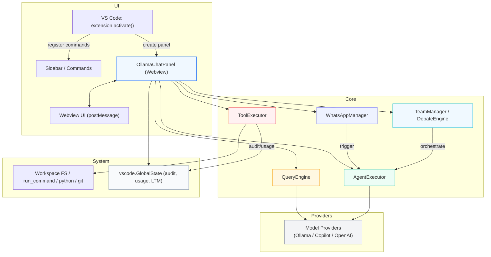

# AmiClaw 系統流程總覽（草稿）

此檔為根據程式碼（例如 `src/extension.ts`, `src/ollama-chat.ts`, `src/chat/*`, `src/tools/*`, `src/webview/*`）整理的系統流程草稿，採「中等細節」：包含高階架構圖與 Agent → Tool 的權限流程範例。

## 高階流程圖

## 節點說明（摘要）

- `extension.ts`：擔任啟動與命令註冊入口，會建立 `OllamaChatPanel`（含 silent 背景模式）與 sidebar tree provider。
- `OllamaChatPanel`（`src/ollama-chat.ts`）：Webview 與 extension 的橋樑；負責初始化 `QueryEngine`、`AgentExecutor`、`ToolExecutor`、`WhatsAppManager`、`TeamManager/DebateEngine`，並處理前端 postMessage。
- `QueryEngine`：處理一般問答/Ask 模式（支援唯讀工具：`read_file`、`list_dir`、`search_workspace`、git 查詢等），負責展開檔案提及與呼叫模型 API。
- `AgentExecutor`：Agent 模式核心，實作工具呼叫循環（生成 -> tool_calls -> 執行 -> 回饋），並管理 Agent 的訊息歷程與自動化執行。
- `ToolExecutor`：實際執行檔案 I/O、命令、Jira、Rovo、WhatsApp 等整合，並負責 permission request 與 audit 記錄。
- `WhatsAppManager`：處理 WhatsApp 整合與以外部事件觸發 Agent 的流程（QR 綁定、訊息觸發）。
- `TeamManager` / `DebateEngine`：負責多模型的 Orchestration、交叉注入與回合控制（Task / Discussion / Manager / Debate 模式）。
- Model Providers：支援本機 Ollama、Copilot（VS Code 的 Language Model API）、以及 OpenAI-compatible 端點。

## Agent → Tool 權限流程（範例）

1. AgentExecutor 產生 `tool_calls`（assistant 回覆包含 tools 欄位）。
2. `ToolExecutor.requestPermission(category, description, toolName, diff?)` 檢查：
   - 若為 WA Agent 模式（WhatsApp 觸發）且非 delete，可能自動允許。
   - 檢查設定 `agentAutoApproveWrite`, `toolAlwaysAllow`, `toolAlwaysConfirm` 等。
   - 若需用戶允許，Webview 顯示 permission dialog，並等待回應。
3. 若允許，`ToolExecutor.execute` 會執行（可能呼叫 `write_file`、`run_command`、`replace_in_file` 等），並記錄稽核日誌到 `GlobalState`。
4. 執行結果回傳給 `AgentExecutor`（成功 / 錯誤），Agent 決定是否繼續下一步或退回。

## 外部整合（需在文件中說明）

- Jira / Atlassian：`ToolExecutor.getAtlascodeJiraAuth()` 會嘗試從本機 Atalssian extension 或系統儲存中擷取憑證並使用 API。
- RovoDev：嘗試本機 Rovo Dev server（discovery + SSE stream）以獲取 AI 回覆（見 `ToolExecutor` Rovo 相關函式）。
- WhatsApp：由 `WhatsAppManager` 管理連線/QR/訊息，並可觸發 Agent。
- Ollama / Copilot：模型呼叫分散在 `QueryEngine` 與 `AgentExecutor`，會記錄 token 與 latency。

## 建議的 ToDo.md 結構（本次輸出採中等細節）

1. 概要圖（Mermaid）
2. 節點快速說明（每節 1-2 行）
3. Agent → Tool 權限流程（步驟化）
4. 外部整合清單與注意事項（Jira、Rovo、WhatsApp、模型）
5. 驗證項目與推薦下一步（例如：把 permission 流拓展為序列圖）

---

若同意，我將：
- 把此檔擴充為最終版（更完整的文字說明與必要的檔案連結），但目前先以草稿放在 repo 根供你審核（不自動 commit 以外的流程）。

## 附錄：cc-haha 快速導覽（由 GPT-4.1 提供）

以下為針對工作區 `cc-haha` 的快速結構與風險摘要，方便在跨專案聯合開發時參考。

- 主要入口
  - `bin/claude-haha`：CLI 主程式，啟動本地命令列工具。
  - `desktop/src/`：桌面應用（React + Tauri）前端入口與 UI。
  - `src/server/`：本地 API/WebSocket 伺服器入口（`index.ts`）。
  - `adapters/`：IM 介面 sidecar（Telegram / Feishu / WeChat / DingTalk）。

- 常用開發 / 建置 / 測試 指令
  - `bun run start` 或 `./bin/claude-haha`：啟動 CLI。
  - `SERVER_PORT=3456 bun run src/server/index.ts`：啟動本地 server。
  - `cd desktop && bun run dev`：啟動桌面前端（Vite）。
  - `cd desktop && bun run test`：執行桌面端 Vitest 測試。
  - `cd adapters && bun run test`：執行 adapters 測試。
  - `bun run verify`：執行整體驗證與 coverage。

- 核心目錄與重點檔案
  - `desktop/`：桌面 UI、API client、`src-tauri/`（Rust glue）。重點閱讀：`desktop/src/`、`desktop/src-tauri/`。
  - `src/`：CLI、server、agent runtime（`src/server/`、`src/tools/`）。
  - `adapters/`：各平台 adapter，含 `common/` 共享邏輯。
  - `docs/`：文件（VitePress），以及 `release-notes/`。

- 風險與注意事項
  - `desktop/src-tauri/` 需原生 build（Rust、Tauri），跨平台要求 toolchain。
  - provider 與 adapters 涉及敏感憑證，測試時注意保護並使用 fixtures。
  - Persistence 格式變更需 migration 與 regression tests。

- 推薦下一步（高優先）
  1. 執行 `bun run verify`，檢視整體測試與 coverage。
  2. 查看 `desktop/src/` 與 `src/server/` 的互動流程以理解桌面與 server 之間的通訊。
  3. 執行 `cd adapters && bun run test`，驗證各 adapter 的測試是否通過。

建議：將 `desktop/src`、`src/server`、`adapters` 加入 ToDo.md 的目錄連結區，便於跨專案開發快速導覽。
